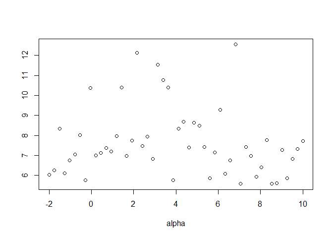
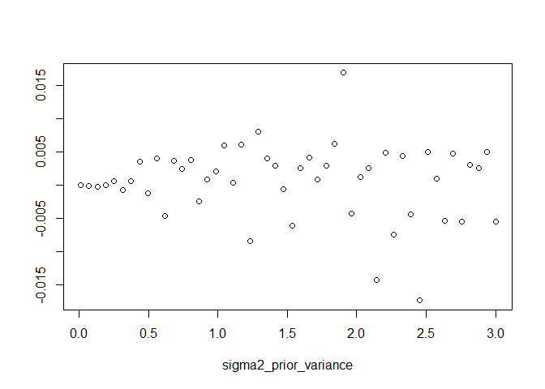

``` r
source('C:/Users/owenj/OneDrive/Uni/Vacation Scholarship/GEKI_Vacation_Scholarship/src/utils/check_covariances.R')
```

# Checking Covariances

When testing the EKI algorithm on a multivariate normal model with
unknown mean and noise, it was found that the EKI algorithm was not able
to identify the true noise parameter, and was anchored to the prior
distribution. The purpose of this markdown document is to explain this
phenomenon.

The main functions for this document can be found in
`src/utils/check_covariances.R` I am interested in looking at three
variables:

- How a covariance matrix changes with the prior mean of $\sigma^2$:
  `plot_covariance_against_sigma2`

- How a covariance matrix changes with the prior variance of $\sigma^2$:
  `plot_covariance_against_sigma2_dispersion`

- How a covariance matrix changes with the prior mean of $\alpha$:
  `plot_covariance_against_alpha`

# Findings

## Checking $C^{yy}$

In this section, I check the covariance of the generated data. In the
known variance case the large sample limit is
$HQH^T + R = 25x^Tx + \sigma^2I$. Thus, we anticipate that the diagonals
of the covariance matrix will increase as the prior mean of the
$p(\sigma^2)$ increases. Additionally, we expect no dependence on the
mean parameter $\alpha$.

``` r
plot_covariance_against_sigma2(check_c_yy)
```

<!-- -->

``` r
plot_covariance_against_alpha(check_c_yy)
```

<!-- -->

The results are what we expect, where there is a strong positive linear
relationship between the mean of the diagonals and $\sigma^2$ but no
relationship between the mean of the diagonals and $\alpha$.

## Checking $C^{yx}$

In this section, I check the cross covariance of the generated data and
the current particles. In the known variance case the large sample limit
is $HQ = 25x^T$. Of course, this is a $d_y \times 1$ matrix, but the
cross covariance in the unknown variance case will be $d_y \times 2$. I
conjecture that the second column will be zeros, since there is no
correlation between the noise parameter $\sigma^2$ and the generated
data. The intuition is that higher levels of $\sigma^2$ increase the
dispersion of the generated data but not its location. To test for this
I look at the mean of the entries in the second column of the covariance
matrices.

``` r
plot_covariance_against_sigma2(check_c_yx)
```

<!-- -->

``` r
plot_covariance_against_sigma2_dispersion(check_c_yx)
```

<!-- -->

``` r
plot_covariance_against_alpha(check_c_yx)
```

<!-- -->

In all plots we see a random fluctuation around zero. Interestingly, as
the dispersion of the prior for $\sigma^2$ increases, so does the
magnitude of these fluctuations. Ideally, we would want to see this same
behavior reflected in the step-size, since the less confident we are in
the prior, the more our particles should respond to the data.

## Checking Stepsize

I am also interested in looking at how the particle movement for
$\sigma^2$ changes as I vary the parameters of the model. Specifically I
am interested in the second column of the matrix

$C^{xy}(C^{yy})^{-1}$ which is equivalent to
$C^{xy}(C^{yy} +(h_l^{-1}-1)C^{y|x})^{-1}$ when $h_l = 1$ (i.e. no
tempering)

If the cross covariance matrix contains zeros, then we expect the
step-size to theoretically be zero as well (empirically very small), and
thus the particles won’t move much from their prior distribution.

``` r
plot_covariance_against_sigma2(check_stepsize)
```

<!-- -->

``` r
plot_covariance_against_sigma2_dispersion(check_stepsize)
```

<!-- -->

``` r
plot_covariance_against_alpha(check_stepsize)
```

<!-- -->

We can see that the step-size appears to fluctuate randomly around zero,
and the magnitude of these fluctuations is extremely small. It is worth
noting that this is without tempering - if we employ tempering the
magnitude of each step will be even smaller.

Unlike $C^{yx}$ the magnitude of the step-size does not appear to change
as the prior variance increases. I believe this is due to offsetting
effects between the components $(C^{yy} + C^{y|x})^{-1}$ and $C^{yx}$.
All else equal, as the prior variances increases $E[\sigma^2]$
increases. This leads to an increase in $C^{yx}$ but a decrease in
$(C^{yy} + C^{y|x})^{-1}$.

# Implications
