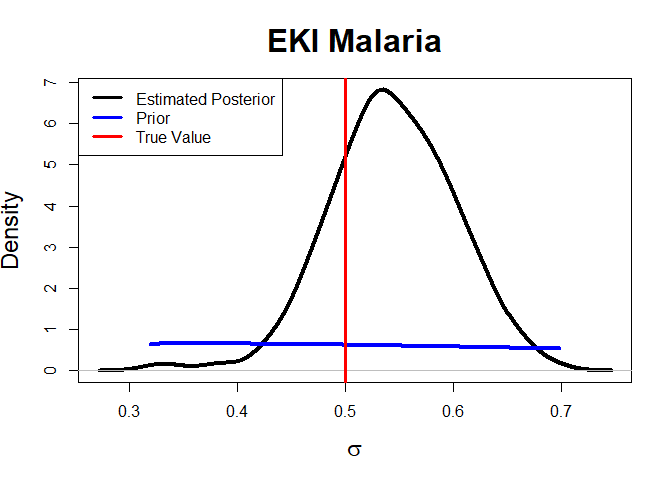
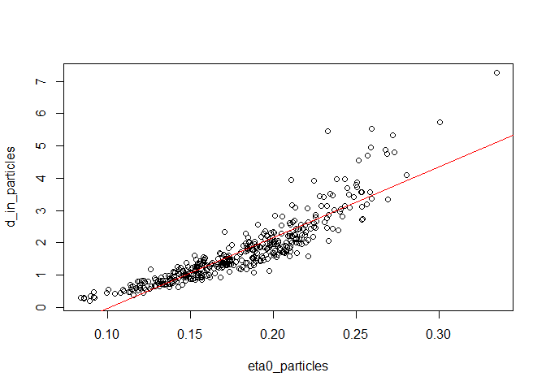
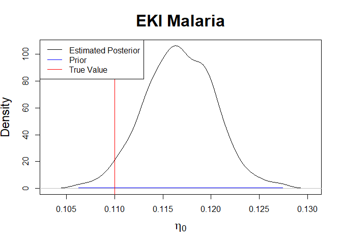

Generalised Ensemble Kalman Inversion - Malaria Model
================
Owen Jackson
2025-01-15

# Results for Malaria Model

## Imports

### External Functions

``` r
pacman::p_load(pacman, testthat, deSolve, rootSolve, MASS, mvtnorm, extraDistr, 
               purrr, glue, logitnorm)
```

### Algorithms

``` r
source('C:/Users/owenj/OneDrive/Uni/Vacation Scholarship/GEKI_Vacation_Scholarship/src/eki.R')
source('C:/Users/owenj/OneDrive/Uni/Vacation Scholarship/GEKI_Vacation_Scholarship/src/eki_known_noise.R')
```

### Models

``` r
source('C:/Users/owenj/OneDrive/Uni/Vacation Scholarship/GEKI_Vacation_Scholarship/src/models/eki_malaria.R')
source('C:/Users/owenj/OneDrive/Uni/Vacation Scholarship/GEKI_Vacation_Scholarship/src/models/eki_malaria_known_var.R')
source('C:/Users/owenj/OneDrive/Uni/Vacation Scholarship/GEKI_Vacation_Scholarship/src/models/eki_malaria_known_d_in.R')
source('C:/Users/owenj/OneDrive/Uni/Vacation Scholarship/GEKI_Vacation_Scholarship/src/models/eki_malaria_d_in_only.R')
source('C:/Users/owenj/OneDrive/Uni/Vacation Scholarship/GEKI_Vacation_Scholarship/src/models/eki_normal_known_var.R')
```

### **Sampling and PDFS**

``` r
source('C:/Users/owenj/OneDrive/Uni/Vacation Scholarship/GEKI_Vacation_Scholarship/src/pdfs/pdfs_normal.R')
source('C:/Users/owenj/OneDrive/Uni/Vacation Scholarship/GEKI_Vacation_Scholarship/src/samples/samples_normal.R')
source('C:/Users/owenj/OneDrive/Uni/Vacation Scholarship/GEKI_Vacation_Scholarship/src/pdfs/pdfs_malaria.R')
source('C:/Users/owenj/OneDrive/Uni/Vacation Scholarship/GEKI_Vacation_Scholarship/src/samples/samples_malaria.R')
```

### Utils

``` r
source('C:/Users/owenj/OneDrive/Uni/Vacation Scholarship/GEKI_Vacation_Scholarship/src/utils/eki_helper.R')
source('C:/Users/owenj/OneDrive/Uni/Vacation Scholarship/GEKI_Vacation_Scholarship/src/utils/tempering.R')
source('C:/Users/owenj/OneDrive/Uni/Vacation Scholarship/GEKI_Vacation_Scholarship/results/plots_normal.R')
source('C:/Users/owenj/OneDrive/Uni/Vacation Scholarship/GEKI_Vacation_Scholarship/results/plots_malaria.R')
```

``` r
adaptive = TRUE
```

## Malaria Transmission Model

``` r
# data_path = "C:/Users/owenj/OneDrive/Uni/Vacation Scholarship/GEKI_Vacation_Scholarship/data/Malariah_data.rds"
# true_sample = log(readRDS(data_path))
# true_data = c(true_sample, sd(true_sample))

num_particles <- 400

prior_params <- list(din.sd = 2,
                     phi.mean = 0, phi.sd = 1,
                     eta0.mean = 0, eta0.sd = 1, 
                     sigma.mean = 0, sigma.sd = 1)

true_params <- list(sigma = 0.5, phi = 0.25, eta0 = 0.11, d_in = 0.5)
true_unconstrained_params = unconstrain_malaria_params(true_params)
true_sample <- likelihood_malaria(true_unconstrained_params)
true_data <- c(true_sample, sd(true_sample))
```

### Four Unknown Parameters

Initially, we tried looking at $\theta = (d_{in}, \phi, \eta_0, \sigma)$
as our unknown parameters.

``` r
eki_result <- eki_malaria(num_particles, true_data, 
                          true_unconstrained_params, prior_params, 
                          adaptive = adaptive)
```

    ## [1] 0 1
    ## Next temp is 0.0227769734808992
    ## Next temp is 0.0469817490436022
    ## Next temp is 0.0714500011995892
    ## Next temp is 0.0960345281422178
    ## Next temp is 0.121821576359666
    ## Next temp is 0.148706296081928
    ## Next temp is 0.173684395592977
    ## Next temp is 0.207081821427544
    ## Next temp is 0.238118223681486
    ## Next temp is 0.267603810131578
    ## Next temp is 0.298747421301004
    ## Next temp is 0.33736489635504
    ## Next temp is 0.376157884014457
    ## Next temp is 0.412414357232035
    ## Next temp is 0.448300314406464
    ## Next temp is 0.487958219914354
    ## Next temp is 0.530517472940706
    ## Next temp is 0.572797205434585
    ## Next temp is 0.619297875650929
    ## Next temp is 0.662654362424036
    ## Next temp is 0.706584513262077
    ## Next temp is 0.756201878979255
    ## Next temp is 0.808263871437686
    ## Next temp is 0.861105210291619
    ## Next temp is 0.912733072226165
    ## Next temp is 0.96558129927607
    ## Next temp is 1

``` r
plot_eki_malaria(eki_result, true_params, prior_params)
```

<!-- --><!-- --><!-- --><!-- -->

``` r
# plot_eki_posterior_predictive(eki_result, true_data, true_unconstrained_params)
```

While the posterior predictive fits the true data well, the GEKI
algorithm has a difficult time identifying the true $d_{in}$ and
$\eta_0$. In that sense, we get values for $d_{in}$ which don’t make
sense in the context of the model.

``` r
d_in_particles <- exp(eki_result$particles[, 1]) + 0.16
eta0_particles <- plogis(eki_result$particles[, 3])
plot(eta0_particles, d_in_particles)
model <- lm(d_in_particles ~ eta0_particles)
abline(model, col = 'red')
```

<!-- -->

``` r
cor(d_in_particles, eta0_particles)
```

    ## [1] 0.901504

Upon closer inspection we see a strong positive correlation between the
$d_{in}$ and $\eta_0$ particles. Essentially the higher values offset
each other, producing predictions which fit the true data. The reason
this has more of an effect on $d_{in}$ is most likely a combination of
the prior distributions and because $d_{in}$ is more sensitive to
changes in $\eta_0$.

It is worth noting that this co-identifiability issue is not unique to
EKI; similar results were found when running SMC on the same model.

### Three Unknown Parameters

Based on the above findings, it was decided to instead look at
$\theta = (\eta_0, \phi, \sigma^2)$.

``` r
# GEKI
eki_result <- eki_malaria_known_d_in(num_particles, true_data, 
                                    true_unconstrained_params, prior_params, 
                                    adaptive = adaptive)
```

    ## [1] 0 1
    ## Next temp is 0.018900918802087
    ## Next temp is 0.0383963453691238
    ## Next temp is 0.0592949704122718
    ## Next temp is 0.07826229992115
    ## Next temp is 0.0979986829046095
    ## Next temp is 0.12129091597951
    ## Next temp is 0.147547669666952
    ## Next temp is 0.17324516452705
    ## Next temp is 0.199794125865963
    ## Next temp is 0.226188157961137
    ## Next temp is 0.252328405524448
    ## Next temp is 0.279898888349767
    ## Next temp is 0.30791123301627
    ## Next temp is 0.33650327734922
    ## Next temp is 0.36848347927652
    ## Next temp is 0.399466912576994
    ## Next temp is 0.429977106932244
    ## Next temp is 0.460942967056609
    ## Next temp is 0.493345429950534
    ## Next temp is 0.527966010632175
    ## Next temp is 0.562688677192781
    ## Next temp is 0.601310221557333
    ## Next temp is 0.637656807923612
    ## Next temp is 0.676770989533844
    ## Next temp is 0.716763675816832
    ## Next temp is 0.760268926670577
    ## Next temp is 0.804629720182921
    ## Next temp is 0.850211279527717
    ## Next temp is 0.893775816110633
    ## Next temp is 0.939538587180195
    ## Next temp is 0.99093675439079
    ## Next temp is 1

``` r
plot_eki_malaria_known_d_in(eki_result, true_params, prior_params)
```

<!-- --><!-- --><!-- -->

``` r
# plot_eki_posterior_predictive_known_d_in(eki_result, true_data, true_unconstrained_params)
```

``` r
plot_eki_malaria_known_d_in(eki_result, true_params, prior_params)
```

<!-- --><!-- --><!-- -->
