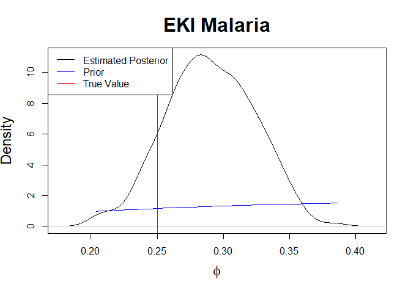

Generalised Ensemble Kalman Inversion - Misspecified Noise
================
Owen Jackson
2025-01-15

# Results for Misspecified Noise

## Imports

### External Functions

``` r
pacman::p_load(pacman, testthat, deSolve, rootSolve, MASS, mvtnorm, extraDistr, 
               purrr, glue, logitnorm)
```

### Algorithms

``` r
source('C:/Users/owenj/OneDrive/Uni/Vacation Scholarship/GEKI_Vacation_Scholarship/src/eki.R')
source('C:/Users/owenj/OneDrive/Uni/Vacation Scholarship/GEKI_Vacation_Scholarship/src/eki_known_noise.R')
```

### Models

``` r
source('C:/Users/owenj/OneDrive/Uni/Vacation Scholarship/GEKI_Vacation_Scholarship/src/models/eki_malaria.R')
source('C:/Users/owenj/OneDrive/Uni/Vacation Scholarship/GEKI_Vacation_Scholarship/src/models/eki_malaria_known_var.R')
source('C:/Users/owenj/OneDrive/Uni/Vacation Scholarship/GEKI_Vacation_Scholarship/src/models/eki_malaria_known_d_in.R')
source('C:/Users/owenj/OneDrive/Uni/Vacation Scholarship/GEKI_Vacation_Scholarship/src/models/eki_malaria_d_in_only.R')
source('C:/Users/owenj/OneDrive/Uni/Vacation Scholarship/GEKI_Vacation_Scholarship/src/models/eki_normal_known_var.R')
```

### **Sampling and PDFS**

``` r
source('C:/Users/owenj/OneDrive/Uni/Vacation Scholarship/GEKI_Vacation_Scholarship/src/pdfs/pdfs_normal.R')
source('C:/Users/owenj/OneDrive/Uni/Vacation Scholarship/GEKI_Vacation_Scholarship/src/samples/samples_normal.R')
source('C:/Users/owenj/OneDrive/Uni/Vacation Scholarship/GEKI_Vacation_Scholarship/src/pdfs/pdfs_malaria.R')
source('C:/Users/owenj/OneDrive/Uni/Vacation Scholarship/GEKI_Vacation_Scholarship/src/samples/samples_malaria.R')
```

### Utils

``` r
source('C:/Users/owenj/OneDrive/Uni/Vacation Scholarship/GEKI_Vacation_Scholarship/src/utils/eki_helper.R')
source('C:/Users/owenj/OneDrive/Uni/Vacation Scholarship/GEKI_Vacation_Scholarship/src/utils/tempering.R')
source('C:/Users/owenj/OneDrive/Uni/Vacation Scholarship/GEKI_Vacation_Scholarship/results/plots_normal.R')
source('C:/Users/owenj/OneDrive/Uni/Vacation Scholarship/GEKI_Vacation_Scholarship/results/plots_malaria.R')
```

``` r
adaptive = TRUE
```

## Malaria Transmission Model

``` r
# data_path = "C:/Users/owenj/OneDrive/Uni/Vacation Scholarship/GEKI_Vacation_Scholarship/data/Malariah_data.rds"
# true_data = log(readRDS(data_path))

num_particles <- 400

prior_params <- list(din.sd = 2,
                     phi.mean = 0, phi.sd = 1,
                     eta0.mean = 0, eta0.sd = 1, 
                     sigma.mean = 0, sigma.sd = 1)

true_params <- list(sigma = 0.5, phi = 0.25, eta0 = 0.11, d_in = 0.5)
true_unconstrained_params = unconstrain_malaria_params(true_params)
true_sample <- likelihood_malaria(true_unconstrained_params)
true_data <- c(true_sample, sd(true_sample))
```

### Four Unknown Parameters

Initially, we tried looking at $\theta = (d_{in}, \phi, \eta_0, \sigma)$
as our unknown parameters.

``` r
eki_result <- eki_malaria(num_particles, true_data, 
                          true_unconstrained_params, prior_params, 
                          adaptive = adaptive)
```

    ## [1] 0 1
    ## Next temp is 0.0214859986404706
    ## Next temp is 0.0420764335742336
    ## Next temp is 0.0633517817634242
    ## Next temp is 0.087789847890104
    ## Next temp is 0.113997399517419
    ## Next temp is 0.141776687404436
    ## Next temp is 0.170006252241763
    ## Next temp is 0.199367063451955
    ## Next temp is 0.229315897762044
    ## Next temp is 0.259139534263199
    ## Next temp is 0.289037044622316
    ## Next temp is 0.32325199194317
    ## Next temp is 0.356737009882669
    ## Next temp is 0.388718203753299
    ## Next temp is 0.42309759415275
    ## Next temp is 0.45637949232576
    ## Next temp is 0.489643517884812
    ## Next temp is 0.524581430026341
    ## Next temp is 0.558643046727803
    ## Next temp is 0.599065064371017
    ## Next temp is 0.643356923787015
    ## Next temp is 0.684688631156648
    ## Next temp is 0.729621996377755
    ## Next temp is 0.775285743500145
    ## Next temp is 0.822669147271911
    ## Next temp is 0.877948201710364
    ## Next temp is 0.92993758052159
    ## Next temp is 0.97716813483542
    ## Next temp is 1

``` r
plot_eki_malaria(eki_result, true_params, prior_params)
```

<!-- --><!-- --><!-- --><!-- -->

``` r
# plot_eki_posterior_predictive(eki_result, true_data, true_unconstrained_params)
```

While the posterior predictive fits the true data well, the GEKI
algorithm has a difficult time identifying the true $d_{in}$ and
$\eta_0$. In that sense, we get values for $d_{in}$ which don’t make
sense in the context of the model.

``` r
d_in_particles <- exp(eki_result$particles[, 1]) + 0.16
eta0_particles <- plogis(eki_result$particles[, 3])
plot(eta0_particles, d_in_particles)
model <- lm(d_in_particles ~ eta0_particles)
abline(model, col = 'red')
```

<!-- -->

``` r
cor(d_in_particles, eta0_particles)
```

    ## [1] 0.9175251

Upon closer inspection we see a strong positive correlation between the
$d_{in}$ and $\eta_0$ particles. Essentially the higher values offset
each other, producing predictions which fit the true data. The reason
this has more of an effect on $d_{in}$ is most likely a combination of
the prior distributions and because $d_{in}$ is more sensitive to
changes in $\eta_0$.

It is worth noting that this co-identifiability issue is not unique to
EKI; similar results were found when running SMC on the same model.

### Three Unknown Parameters

Based on the above findings, it was decided to instead look at
$\theta = (\eta_0, \phi, \sigma^2)$.

``` r
# GEKI
eki_result <- eki_malaria_known_d_in(num_particles, true_data, 
                                    true_unconstrained_params, prior_params, 
                                    adaptive = adaptive)
```

    ## [1] 0 1
    ## Next temp is 0.0173709699466866
    ## Next temp is 0.03658256624922
    ## Next temp is 0.055894389039739
    ## Next temp is 0.0756701685106349
    ## Next temp is 0.0966076335321717
    ## Next temp is 0.11861034064947
    ## Next temp is 0.144898998318669
    ## Next temp is 0.171630747598486
    ## Next temp is 0.197416665458268
    ## Next temp is 0.226439755115891
    ## Next temp is 0.254361306935328
    ## Next temp is 0.282202336885334
    ## Next temp is 0.311804260488528
    ## Next temp is 0.343370581783615
    ## Next temp is 0.377518379271185
    ## Next temp is 0.410255652767072
    ## Next temp is 0.443806436616116
    ## Next temp is 0.477731180658274
    ## Next temp is 0.518054804499631
    ## Next temp is 0.555591063958246
    ## Next temp is 0.600928308043683
    ## Next temp is 0.644973605076776
    ## Next temp is 0.691433481195814
    ## Next temp is 0.741057391906672
    ## Next temp is 0.791549492730784
    ## Next temp is 0.840888945344116
    ## Next temp is 0.896419826976013
    ## Next temp is 0.955810267627807
    ## Next temp is 1

``` r
plot_eki_malaria_known_d_in(eki_result, true_params, prior_params)
```

<!-- --><!-- --><!-- -->

``` r
# plot_eki_posterior_predictive_known_d_in(eki_result, true_data, true_unconstrained_params)
```

``` r
plot_eki_malaria_known_d_in(eki_result, true_params, prior_params)
```

<!-- --><!-- --><!-- -->
