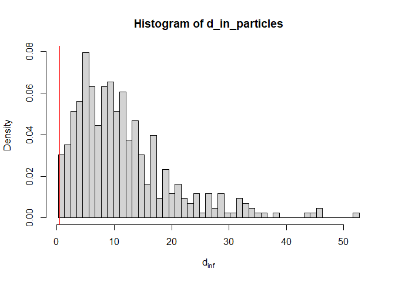
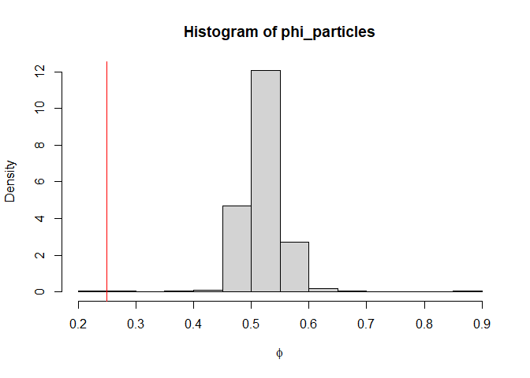
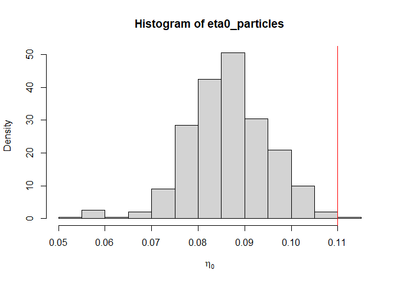
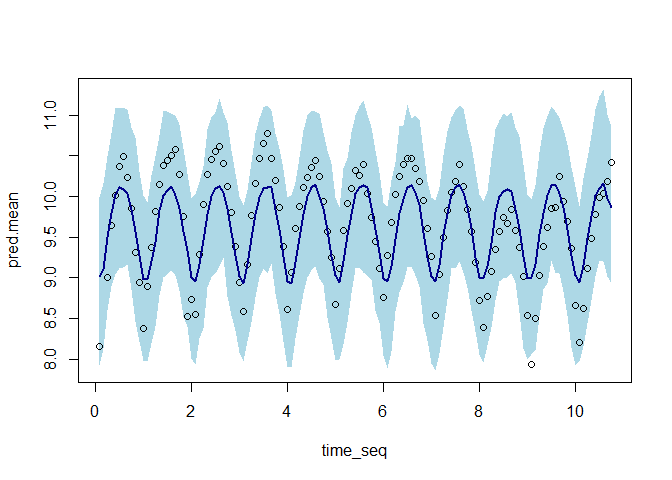
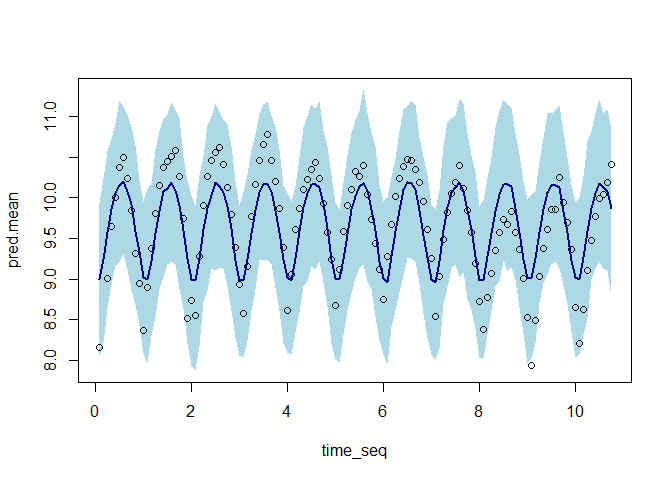

Generalised Ensemble Kalman Inversion - Misspecified Noise
================
Owen Jackson
2025-01-15

# Results for Misspecified Noise

## Imports

### External Functions

``` r
pacman::p_load(pacman, testthat, deSolve, rootSolve, MASS, mvtnorm, extraDistr, 
               purrr, glue)
```

### Algorithms

``` r
source('C:/Users/owenj/OneDrive/Uni/Vacation Scholarship/GEKI_Vacation_Scholarship/src/eki.R')
source('C:/Users/owenj/OneDrive/Uni/Vacation Scholarship/GEKI_Vacation_Scholarship/src/eki_known_noise.R')
```

### Models

``` r
source('C:/Users/owenj/OneDrive/Uni/Vacation Scholarship/GEKI_Vacation_Scholarship/src/models/eki_malaria_known_var.R')
source('C:/Users/owenj/OneDrive/Uni/Vacation Scholarship/GEKI_Vacation_Scholarship/src/models/eki_malaria_d_in_only.R')
source('C:/Users/owenj/OneDrive/Uni/Vacation Scholarship/GEKI_Vacation_Scholarship/src/models/eki_normal_known_var.R')
```

### **Sampling and PDFS**

``` r
source('C:/Users/owenj/OneDrive/Uni/Vacation Scholarship/GEKI_Vacation_Scholarship/src/pdfs/pdfs_normal.R')
source('C:/Users/owenj/OneDrive/Uni/Vacation Scholarship/GEKI_Vacation_Scholarship/src/samples/samples_normal.R')
source('C:/Users/owenj/OneDrive/Uni/Vacation Scholarship/GEKI_Vacation_Scholarship/src/pdfs/pdfs_malaria.R')
source('C:/Users/owenj/OneDrive/Uni/Vacation Scholarship/GEKI_Vacation_Scholarship/src/samples/samples_malaria.R')
```

### Utils

``` r
source('C:/Users/owenj/OneDrive/Uni/Vacation Scholarship/GEKI_Vacation_Scholarship/src/utils/eki_helper.R')
source('C:/Users/owenj/OneDrive/Uni/Vacation Scholarship/GEKI_Vacation_Scholarship/src/utils/tempering.R')
source('C:/Users/owenj/OneDrive/Uni/Vacation Scholarship/GEKI_Vacation_Scholarship/results/plots_normal.R')
source('C:/Users/owenj/OneDrive/Uni/Vacation Scholarship/GEKI_Vacation_Scholarship/results/plots_malaria.R')
```

    ## Next temp is 2

``` r
adaptive = FALSE
```

## Introduction

When looking at the multivariate normal model, it was found that GEKI
does not do a good job at estimating the noise parameter. Following on
from those results, the next step of the project was to investigate
whether GEKI outperforms EKI in the cases where the noise parameter is
known, but misspecified. Specifically, it is chosen to be too small. In
the context of EKI we would expect the concentration of the particles to
be too narrow and potentially away from the true parameter when we
diverge from the linear Gaussian setting.

## Multivariate Normal Model

In the linear Gaussian setting, we have an analytically tractable
posterior. If we misspecify the noise to be less than the actual noise,
the particles will remain asymptotically unbiased, but the variance will
be too small. This becomes a bigger problem in settings where EKI is
biased, because we may not cover the true parameters.

``` r
num_particles <- 1000
prior_params <- list(alpha.mean = 0, alpha.sd = 5, 
                     sigma2.mean = 2, sigma2.sd = 1)

true_parameters <- list(alpha = 2, sigma = 2, x = rep(1, 50))
true_data = likelihood_normal(true_parameters)
misspecified_parameters <- list(alpha = 2, sigma = 0.5, x = rep(1, 50))

eki_result <- eki_normal_known_var(num_particles, true_data, 
                                   misspecified_parameters, 
                                   prior_params, general = F, 
                                   adaptive = adaptive)
```

    ## [1] 0.5
    ## Next temp is 0.1
    ## Next temp is 0.2
    ## Next temp is 0.3
    ## Next temp is 0.4
    ## Next temp is 0.5
    ## Next temp is 0.6
    ## Next temp is 0.7
    ## Next temp is 0.8
    ## Next temp is 0.9
    ## Next temp is 1

``` r
plot_eki_normal_known_var(eki_result, true_data, true_parameters, prior_params)
```

<!-- -->

``` r
eki_result <- eki_normal_known_var(num_particles, true_data, 
                                   misspecified_parameters, 
                                   prior_params, general = T,
                                   adaptive = adaptive)
```

    ## Next temp is 0.1
    ## Next temp is 0.2
    ## Next temp is 0.3
    ## Next temp is 0.4
    ## Next temp is 0.5
    ## Next temp is 0.6
    ## Next temp is 0.7
    ## Next temp is 0.8
    ## Next temp is 0.9
    ## Next temp is 1

``` r
plot_eki_normal_known_var(eki_result, true_data, true_parameters, prior_params)
```

<!-- -->

Notably, this happens in both EKI and GEKI because GEKI was designed to
remain asymptotically unbiased in the linear Gaussian case. The question
remains as to whether this also occurs in other settings.

## Malaria Transmission Model

``` r
data_path = "C:/Users/owenj/OneDrive/Uni/Vacation Scholarship/GEKI_Vacation_Scholarship/data/Malariah_data.rds"
true_data = log(readRDS(data_path))

num_particles <- 400

prior_params <- list(din.sd = 2,
                     phi.mean = 0, phi.sd = 1,
                     eta0.mean = 0, eta0.sd = 1)

true_params <- list(sigma = 0.5, phi = 0.5, eta0 = 0.04, d_in = 0.5)
true_unconstrained_params = unconstrain_malaria_params(true_params)
```

``` r
# EKI
eki_result <- eki_malaria_known_var(num_particles, true_data, 
                                    true_unconstrained_params, prior_params, 
                                    general = F, adaptive = adaptive)
```

    ## [1] -0.6931472
    ## Next temp is 0.1
    ## Next temp is 0.2
    ## Next temp is 0.3
    ## Next temp is 0.4
    ## Next temp is 0.5
    ## Next temp is 0.6
    ## Next temp is 0.7
    ## Next temp is 0.8
    ## Next temp is 0.9
    ## Next temp is 1

``` r
plot_eki_malaria_known_var(eki_result)
```

<!-- --><!-- --><!-- -->

``` r
plot_eki_posterior_predictive(eki_result, true_data, true_unconstrained_params)
```

<!-- -->

``` r
# GEKI
eki_result <- eki_malaria_known_var(num_particles, true_data, 
                                    true_unconstrained_params, 
                                    prior_params, adaptive = adaptive)
```

    ## Next temp is 0.1
    ## Next temp is 0.2
    ## Next temp is 0.3
    ## Next temp is 0.4
    ## Next temp is 0.5
    ## Next temp is 0.6
    ## Next temp is 0.7
    ## Next temp is 0.8
    ## Next temp is 0.9
    ## Next temp is 1

``` r
plot_eki_malaria_known_var(eki_result)
```

<!-- --><!-- --><!-- -->

``` r
plot_eki_posterior_predictive(eki_result, true_data, true_unconstrained_params)
```

<!-- -->

### $d_{in}$ Only

``` r
eki_result <- eki_malaria_d_in_only(num_particles, true_data, 
                                    true_unconstrained_params, 
                                    prior_params, adaptive = adaptive)
```

    ## Next temp is 0.1
    ## Next temp is 0.2
    ## Next temp is 0.3
    ## Next temp is 0.4
    ## Next temp is 0.5
    ## Next temp is 0.6
    ## Next temp is 0.7
    ## Next temp is 0.8
    ## Next temp is 0.9
    ## Next temp is 1

``` r
plot_eki_malaria_d_in_only(eki_result)
```

<!-- -->

``` r
plot_eki_posterior_predictive_d_in_only(eki_result, true_data, true_unconstrained_params)
```

<!-- -->

``` r
mean(exp(eki_result$particles) + 0.16)
```

    ## [1] 3.275867
