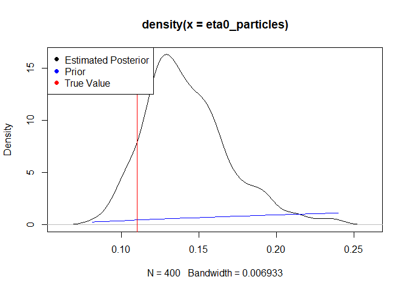
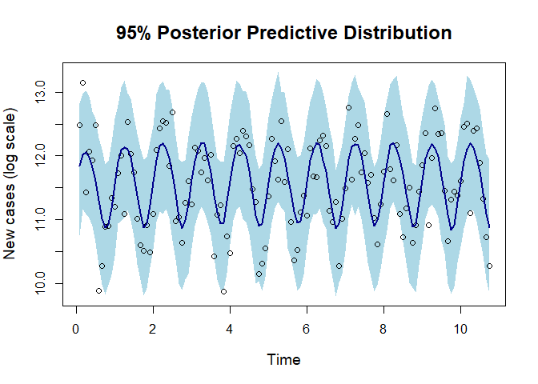

Generalised Ensemble Kalman Inversion - Misspecified Noise
================
Owen Jackson
2025-01-15

# Results for Misspecified Noise

## Imports

### External Functions

``` r
pacman::p_load(pacman, testthat, deSolve, rootSolve, MASS, mvtnorm, extraDistr, 
               purrr, glue, logitnorm)
```

### Algorithms

``` r
source('C:/Users/owenj/OneDrive/Uni/Vacation Scholarship/GEKI_Vacation_Scholarship/src/eki.R')
source('C:/Users/owenj/OneDrive/Uni/Vacation Scholarship/GEKI_Vacation_Scholarship/src/eki_known_noise.R')
```

### Models

``` r
source('C:/Users/owenj/OneDrive/Uni/Vacation Scholarship/GEKI_Vacation_Scholarship/src/models/eki_malaria.R')
source('C:/Users/owenj/OneDrive/Uni/Vacation Scholarship/GEKI_Vacation_Scholarship/src/models/eki_malaria_known_var.R')
source('C:/Users/owenj/OneDrive/Uni/Vacation Scholarship/GEKI_Vacation_Scholarship/src/models/eki_malaria_known_d_in.R')
source('C:/Users/owenj/OneDrive/Uni/Vacation Scholarship/GEKI_Vacation_Scholarship/src/models/eki_malaria_d_in_only.R')
source('C:/Users/owenj/OneDrive/Uni/Vacation Scholarship/GEKI_Vacation_Scholarship/src/models/eki_normal_known_var.R')
```

### **Sampling and PDFS**

``` r
source('C:/Users/owenj/OneDrive/Uni/Vacation Scholarship/GEKI_Vacation_Scholarship/src/pdfs/pdfs_normal.R')
source('C:/Users/owenj/OneDrive/Uni/Vacation Scholarship/GEKI_Vacation_Scholarship/src/samples/samples_normal.R')
source('C:/Users/owenj/OneDrive/Uni/Vacation Scholarship/GEKI_Vacation_Scholarship/src/pdfs/pdfs_malaria.R')
source('C:/Users/owenj/OneDrive/Uni/Vacation Scholarship/GEKI_Vacation_Scholarship/src/samples/samples_malaria.R')
```

### Utils

``` r
source('C:/Users/owenj/OneDrive/Uni/Vacation Scholarship/GEKI_Vacation_Scholarship/src/utils/eki_helper.R')
source('C:/Users/owenj/OneDrive/Uni/Vacation Scholarship/GEKI_Vacation_Scholarship/src/utils/tempering.R')
source('C:/Users/owenj/OneDrive/Uni/Vacation Scholarship/GEKI_Vacation_Scholarship/results/plots_normal.R')
source('C:/Users/owenj/OneDrive/Uni/Vacation Scholarship/GEKI_Vacation_Scholarship/results/plots_malaria.R')
```

``` r
adaptive = TRUE
```

## Introduction

When looking at the multivariate normal model, it was found that GEKI
does not do a good job at estimating the noise parameter. Following on
from those results, the next step of the project was to investigate
whether GEKI outperforms EKI in the cases where the noise parameter is
known, but misspecified. Specifically, it is chosen to be too small. In
the context of EKI we would expect the concentration of the particles to
be too narrow and potentially away from the true parameter when we
diverge from the linear Gaussian setting.

## Multivariate Normal Model

In the linear Gaussian setting, we have an analytically tractable
posterior. If we misspecify the noise to be less than the actual noise,
the particles will remain asymptotically unbiased, but the variance will
be too small. This becomes a bigger problem in settings where EKI is
biased, because we may not cover the true parameters.

``` r
num_particles <- 1000
prior_params <- list(alpha.mean = 0, alpha.sd = 5, 
                     sigma2.mean = 2, sigma2.sd = 1)

true_parameters <- list(alpha = 2, sigma = 2, x = rep(1, 50))
true_data = likelihood_normal(true_parameters)
misspecified_parameters <- list(alpha = 2, sigma = 0.5, x = rep(1, 50))

eki_result <- eki_normal_known_var(num_particles, true_data, 
                                   misspecified_parameters, 
                                   prior_params, general = F, 
                                   adaptive = adaptive)
```

    ## [1] 1.648721
    ## Next temp is 0.00109456010842656
    ## Next temp is 0.00275061740173493
    ## Next temp is 0.00547563243937203
    ## Next temp is 0.0101398737540006
    ## Next temp is 0.0174403569722026
    ## Next temp is 0.0297208579554834
    ## Next temp is 0.0482678460924481
    ## Next temp is 0.0769566797757383
    ## Next temp is 0.122512037409439
    ## Next temp is 0.18702463937345
    ## Next temp is 0.285985192658083
    ## Next temp is 0.458186968653754
    ## Next temp is 0.726803507316946
    ## Next temp is 1

``` r
plot_eki_normal_known_var(eki_result, true_data, true_parameters, prior_params)
```

<!-- -->

``` r
eki_result <- eki_normal_known_var(num_particles, true_data, 
                                   misspecified_parameters, 
                                   prior_params, general = T,
                                   adaptive = adaptive)
```

    ## Next temp is 0.00107126389891474
    ## Next temp is 0.00889950057894549
    ## Next temp is 0.0726237534186124
    ## Next temp is 0.597831532573773
    ## Next temp is 1

``` r
plot_eki_normal_known_var(eki_result, true_data, true_parameters, prior_params)
```

<!-- -->

Notably, this happens in both EKI and GEKI because GEKI was designed to
remain asymptotically unbiased in the linear Gaussian case. The question
remains as to whether this also occurs in other settings.

## Malaria Transmission Model

The Malaria Transmission Model is an extension of a standard
Suspectible-Infected-Recovered (SIR) model. In the model we have four
states: Suspectible (S), Infected without Immunity (I1), Infected with
prior immunity (I2) and Recovered (R). The system of differential
equations is described in more detail in the Malaria Transmission Model
specification document. Note that $W(t)$ represents the cumulative
number of cases by time $t$.

``` r
# data_path = "C:/Users/owenj/OneDrive/Uni/Vacation Scholarship/GEKI_Vacation_Scholarship/data/Malariah_data.rds"
# true_data = log(readRDS(data_path))

num_particles <- 400

prior_params <- list(din.sd = 2,
                     phi.mean = 0, phi.sd = 1,
                     eta0.mean = 0, eta0.sd = 1)

true_params <- list(sigma = 0.5, phi = 0.25, eta0 = 0.11, d_in = 0.5)
true_unconstrained_params = unconstrain_malaria_params(true_params)
true_data <- likelihood_malaria(true_unconstrained_params)
```

### Three Unknown Parameters

Initially, we tried looking at $\theta = (d_{in}, \phi, \eta_0)$ as our
unknown parameters.

``` r
# # EKI
# eki_result <- eki_malaria_known_var(num_particles, true_data, 
#                                     true_unconstrained_params, prior_params, 
#                                     general = F, adaptive = adaptive)
# plot_eki_malaria_known_var(eki_result, true_params, prior_params)
```

``` r
# GEKI
eki_result <- eki_malaria_known_var(num_particles, true_data, 
                                    true_unconstrained_params, 
                                    prior_params, adaptive = adaptive)
```

    ## [1] 0 1
    ## Next temp is 0.00575183921124582
    ## Next temp is 0.0123315111311542
    ## Next temp is 0.0197541755133013
    ## Next temp is 0.0279967795160268
    ## Next temp is 0.0374350442278896
    ## Next temp is 0.0481393697685039
    ## Next temp is 0.0614709110631394
    ## Next temp is 0.0772011581418288
    ## Next temp is 0.0970329352628461
    ## Next temp is 0.122260290005133
    ## Next temp is 0.150949257166007
    ## Next temp is 0.188285409351479
    ## Next temp is 0.239805967201817
    ## Next temp is 0.305306409891022
    ## Next temp is 0.389500080334431
    ## Next temp is 0.506606052690755
    ## Next temp is 0.699612176292003
    ## Next temp is 1

``` r
plot_eki_malaria_known_var(eki_result, true_params, prior_params)
```

<!-- --><!-- --><!-- -->

``` r
plot_eki_posterior_predictive_known_var(eki_result, true_data, true_unconstrained_params)
```

<!-- -->

While the posterior predictive fits the true data well, the EKI and GEKI
algorithms have a difficult time identifying the true $d_{in}$ and
$\eta_0$. In that sense, we get values for $d_{in}$ which don’t make
sense in the context of the model.

``` r
d_in_particles <- exp(eki_result$particles[, 1]) + 0.16
eta0_particles <- plogis(eki_result$particles[, 3])
plot(eta0_particles, d_in_particles, xlab = expression(eta[0]), ylab = expression(d[inf]),
     main = 'Relationship between parameters', cex.main = 1.5, cex.lab = 1.2)
model <- lm(d_in_particles ~ eta0_particles)
abline(model, col = 'red')
```

<!-- -->

``` r
cor(d_in_particles, eta0_particles)
```

    ## [1] 0.8914845

Upon closer inspection we see a strong positive correlation between the
$d_{in}$ and $\eta_0$ particles. Essentially the higher values offset
each other, producing predictions which fit the true data. The reason
this has more of an effect on $d_{in}$ is most likely a combination of
the prior distributions and because $d_{in}$ is more sensitive to
changes in $\eta_0$.

It is worth noting that this co-identifiability issue is not unique to
EKI; similar results were found when running SMC on the same model.

### Two Unknown Parameters

Based on the above findings, it was decided to instead look at
$\theta = (\eta_0, \phi)$.

``` r
# # EKI
# eki_result <- eki_malaria_known_d_in(num_particles, true_data, 
#                                     true_unconstrained_params, prior_params, 
#                                     general = F, adaptive = adaptive)
# plot_eki_malaria_known_d_in(eki_result, true_params, prior_params)
# plot_eki_posterior_predictive_known_d_in(eki_result, true_data, true_unconstrained_params)
```

``` r
# # GEKI
# eki_result <- eki_malaria_known_d_in(num_particles, true_data, 
#                                     true_unconstrained_params, prior_params, 
#                                     adaptive = adaptive)
# plot_eki_malaria_known_d_in(eki_result, true_params, prior_params)
# plot_eki_posterior_predictive_known_d_in(eki_result, true_data, true_unconstrained_params)
```

### Misspecified Noise

We again consider $\theta = (\eta_0, \phi)$, but under-specify the
noise, relative to the true data. Since the noise of the true data is
$\sigma = 0.5$ we choose instead $\sigma = 0.33$.

``` r
# true_params <- list(sigma = 1, phi = 0.25, eta0 = 0.11, d_in = 0.5)
# true_unconstrained_params = unconstrain_malaria_params(true_params)
```

``` r
# # EKI
# eki_result <- eki_malaria_known_d_in(num_particles, true_data, 
#                                     true_unconstrained_params, prior_params, 
#                                     general = T, adaptive = adaptive)
# plot_eki_malaria_known_d_in(eki_result, true_params, prior_params)
# plot_eki_posterior_predictive_known_d_in(eki_result, true_data, true_unconstrained_params)
```

``` r
# # GEKI
# eki_result <- eki_malaria_known_d_in(num_particles, true_data, 
#                                     true_unconstrained_params, prior_params, 
#                                     adaptive = adaptive)
# plot_eki_malaria_known_d_in(eki_result, true_params, prior_params)
# plot_eki_posterior_predictive_known_d_in(eki_result, true_data, true_unconstrained_params)
```

### $d_{in}$ Only

``` r
# eki_result <- eki_malaria_d_in_only(num_particles, true_data, 
#                                     true_unconstrained_params, general = F,
#                                     prior_params, adaptive = adaptive)
# plot_eki_malaria_d_in_only(eki_result, true_params)
# plot_eki_posterior_predictive_d_in_only(eki_result, true_data, true_unconstrained_params)
```
