Generalised Ensemble Kalman Inversion - Multivariate Normal Model
================
Owen Jackson
2025-01-15

# Results For Multivariate Normal Model

## Import Functions

### External Packages

``` r
pacman::p_load(pacman, purrr, mvtnorm, mcmc, MASS, glue)
```

### Algorithms

``` r
source('C:/Users/owenj/OneDrive/Uni/Vacation Scholarship/GEKI_Vacation_Scholarship/src/eki.R')
source('C:/Users/owenj/OneDrive/Uni/Vacation Scholarship/GEKI_Vacation_Scholarship/src/mcmc_normal.R')
```

### Models

``` r
source('C:/Users/owenj/OneDrive/Uni/Vacation Scholarship/GEKI_Vacation_Scholarship/src/models/eki_normal.R')
source('C:/Users/owenj/OneDrive/Uni/Vacation Scholarship/GEKI_Vacation_Scholarship/src/models/eki_normal_known_var.R')
source('C:/Users/owenj/OneDrive/Uni/Vacation Scholarship/GEKI_Vacation_Scholarship/src/models/eki_normal_known_mean.R')
```

### Sampling and PDFs

``` r
source('C:/Users/owenj/OneDrive/Uni/Vacation Scholarship/GEKI_Vacation_Scholarship/src/pdfs/pdfs_normal.R')
source('C:/Users/owenj/OneDrive/Uni/Vacation Scholarship/GEKI_Vacation_Scholarship/src/samples/samples_normal.R')
```

### Utils

``` r
source('C:/Users/owenj/OneDrive/Uni/Vacation Scholarship/GEKI_Vacation_Scholarship/src/utils/tempering.R')
source('C:/Users/owenj/OneDrive/Uni/Vacation Scholarship/GEKI_Vacation_Scholarship/src/utils/eki_helper.R')
source('C:/Users/owenj/OneDrive/Uni/Vacation Scholarship/GEKI_Vacation_Scholarship/results/plots_normal.R')
```

``` r
generate_results <- function(num_particles, true_parameters) {
  
  true_sample <- likelihood_normal(true_parameters)
  true_data <- c(true_sample, sd(true_sample))
  
  # Model 1
  eki_result_known_var <- eki_normal_known_var(num_particles, true_data, true_parameters, 
                                               prior_params, adaptive = adaptive)
  plot_eki_normal_known_var(eki_result_known_var, true_sample, 
                            true_parameters, prior_params)
  
  # Model 2
  eki_result_known_mean <- eki_normal_known_mean(num_particles, true_data, true_parameters, 
                                                 prior_params, adaptive = adaptive)
  plot_eki_normal_known_mean(eki_result_known_mean, true_parameters, prior_params)
  
  # Model 3
  eki_result <- eki_normal(num_particles, true_data, true_parameters, 
                           prior_params, adaptive = adaptive)
  plot_eki_normal(eki_result, true_parameters, prior_params)
  
  # # MCMC Comparison for Model 3
  # run.1 <- normal_mcmc(true_data, true_parameters, prior_params)
  # chain.1 <- run.1$batch
  # run.2 <- normal_mcmc(true_data, true_parameters, prior_params)
  # chain.2 <- run.2$batch
  # plot_mcmc_trace_plots(chain.1, chain.2, burnin = 500)
  # plot_mcmc_histogram(chain.1, chain.2, true_parameters, prior_params, 
  #                     burnin = 500)
  
}
```

## The Model

We assume that we have access to a single observation from a
multivariate normal distribution $y \sim N(\alpha x, \sigma^2I)$ where
$\alpha$ is a scalar and $x$ is a known vector. We further augment this
data with the sample standard deviation $s_y$.

I look at three variations of this model

- The variance is known, but the mean is not $\theta = \alpha$

- The mean is known, but the variance is not $\theta = \sigma^2$

- Both parameters are unknown $\theta = (\alpha, \sigma^2)$.

I look at a range of combinations of $\alpha, x$ and $\sigma^2$,
comparing against MCMC sampling. Of particular interest is how well GEKI
is able to estimate the noise parameter, since previous EKI algorithms
require the noise parameter to be known.

### Priors

In all combinations we draw from the same priors (if that parameter is
considered unknown):

- $\alpha \sim ~ N(0, 5^2)$

- $\log(\sigma^2) \sim N(2, 1^2)$

``` r
prior_params <- list(alpha.mean = 0, alpha.sd = 5, 
                     sigma2.mean = 2, sigma2.sd = 1)
```

### Adaptive Tempering

``` r
adaptive = TRUE
```

### Output

For each variation of the model, I plot the EKI histograms of the
particles against their prior. In the known mean, unknown variance case,
I also plot the posterior since there is an analytical posterior in this
special case. This serves as a check that the algorithm has been
implemented correctly.

## Changing Number of Dimensions

In this experiment I keep $\alpha$ and $\sigma^2$ fixed at 2 and 4
respectively and let $x$ be a vector of 1s corresponding to 10, 50 and
100 dimensions. I keep the number of particles fixed at 400. The purpose
of this is to see how the EKI algorithm performs when the number of
dimensions increases.

``` r
num_dimensions <- c(10, 50, 100)
num_particles <- 400
for (dimension in num_dimensions) {
  true_parameters <- list(alpha = 2, sigma = 2, x = rep(1, dimension))
  generate_results(num_particles, true_parameters)
  # true_sample <- likelihood_normal(true_parameters)
  # true_data <- c(mean(true_sample), sd(true_sample))
  # eki_result <- eki_normal(num_particles, true_data, true_parameters, 
  #                        prior_params, adaptive = adaptive)
  # plot_eki_normal(eki_result, true_parameters, prior_params)
}
```

    ## Next temp is 0.072915989933793
    ## Next temp is 0.229818402577502
    ## Next temp is 0.441908593671091
    ## Next temp is 0.686652440336667
    ## Next temp is 0.959114925600569
    ## Next temp is 1

<!-- -->

    ## Next temp is 0.413799404730522
    ## Next temp is 0.784230758921482
    ## Next temp is 1

<!-- -->

    ## Next temp is 0.118065550615107
    ## Next temp is 0.365698621287266
    ## Next temp is 0.65166388865955
    ## Next temp is 0.953487194022587
    ## Next temp is 1

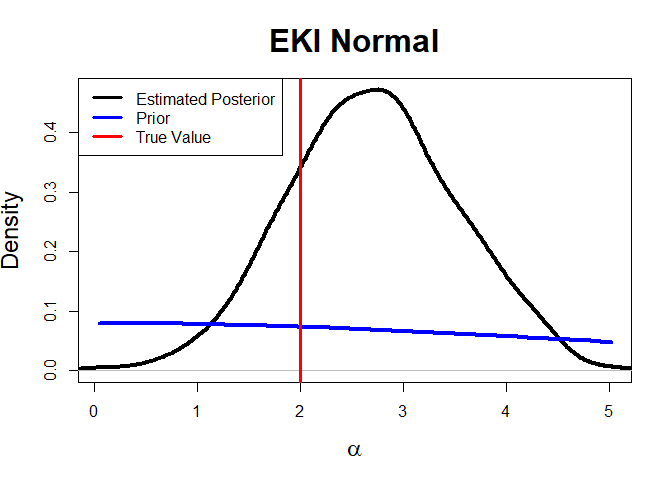<!-- --><!-- -->

    ## Next temp is 0.0144605850810461
    ## Next temp is 0.0679836174050598
    ## Next temp is 0.14452358490831
    ## Next temp is 0.232461823745745
    ## Next temp is 0.331398579987877
    ## Next temp is 0.42638079319724
    ## Next temp is 0.522347328498265
    ## Next temp is 0.61174303364359
    ## Next temp is 0.703850816878332
    ## Next temp is 0.797526739967545
    ## Next temp is 0.88813706674606
    ## Next temp is 0.988490862549094
    ## Next temp is 1

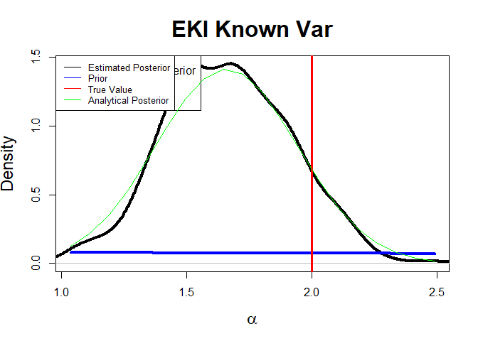<!-- -->

    ## Next temp is 0.105486512749361
    ## Next temp is 0.204392662033672
    ## Next temp is 0.306587540571151
    ## Next temp is 0.414890100585139
    ## Next temp is 0.527307045817448
    ## Next temp is 0.624848791727987
    ## Next temp is 0.727656951155257
    ## Next temp is 0.832202534593157
    ## Next temp is 0.938281467277106
    ## Next temp is 1

<!-- -->

    ## Next temp is 0.0254843026231856
    ## Next temp is 0.0822308449094301
    ## Next temp is 0.157749032891782
    ## Next temp is 0.247655210603326
    ## Next temp is 0.34276785034143
    ## Next temp is 0.441238892215239
    ## Next temp is 0.539898750254496
    ## Next temp is 0.62903784701471
    ## Next temp is 0.739625869256515
    ## Next temp is 0.84110360152032
    ## Next temp is 0.956231581849765
    ## Next temp is 1

<!-- --><!-- -->

    ## Next temp is 0.00659483783090389
    ## Next temp is 0.0434167552526872
    ## Next temp is 0.105224285060428
    ## Next temp is 0.177106134772426
    ## Next temp is 0.238743647159479
    ## Next temp is 0.317809296998388
    ## Next temp is 0.383837889355903
    ## Next temp is 0.449103967534293
    ## Next temp is 0.514258833230805
    ## Next temp is 0.588163951150377
    ## Next temp is 0.660972082717479
    ## Next temp is 0.729310171618928
    ## Next temp is 0.79656826014894
    ## Next temp is 0.867193742320168
    ## Next temp is 0.937844689112706
    ## Next temp is 1

<!-- -->

    ## Next temp is 0.0445889852891832
    ## Next temp is 0.087552471018189
    ## Next temp is 0.135103867955831
    ## Next temp is 0.181778940259783
    ## Next temp is 0.240775558050262
    ## Next temp is 0.307543795307177
    ## Next temp is 0.370351697663002
    ## Next temp is 0.430840271912155
    ## Next temp is 0.49526298966843
    ## Next temp is 0.557146577299053
    ## Next temp is 0.622938415163806
    ## Next temp is 0.693131399164098
    ## Next temp is 0.759514939531547
    ## Next temp is 0.829568805722001
    ## Next temp is 0.893702561484018
    ## Next temp is 0.959173538133135
    ## Next temp is 1

<!-- -->

    ## Next temp is 0.0114710427394206
    ## Next temp is 0.0334490378430355
    ## Next temp is 0.0664156949555883
    ## Next temp is 0.107557828841083
    ## Next temp is 0.151718526848143
    ## Next temp is 0.204019741312711
    ## Next temp is 0.25865997579915
    ## Next temp is 0.324872865619254
    ## Next temp is 0.384779567656125
    ## Next temp is 0.451939120139442
    ## Next temp is 0.515586145912536
    ## Next temp is 0.583074762015894
    ## Next temp is 0.648645945621835
    ## Next temp is 0.71874471430579
    ## Next temp is 0.790103787209117
    ## Next temp is 0.861685581687746
    ## Next temp is 0.933387116199308
    ## Next temp is 0.996287416450817
    ## Next temp is 1

<!-- --><!-- -->

Overall, EKI is able to estimate both parameters quite well in this
scenario. We can see a significant movement away from the prior
distribution for both parameters, which is promising. Additionally, in
the known variance scenario, the posterior is still exact, which is what
we expect with sufficient statistics.

## Changing $\alpha$

In this experiment, I keep $\sigma^2$ fixed at 4, make $x$ a
50-dimensional vector of 1s and change $\alpha$ from 0 to 10 in
increments of 2. The purpose of this is to make sure that the EKI
algorithm is accurate across of range of $\alpha$ and if it changes how
the noise parameter is estimated.

``` r
alpha_seq <- seq(0, 10, length.out = 6)
num_dimensions <- 50 
num_particles <- 400
for (alpha in alpha_seq) {    
  true_parameters <- list(alpha = alpha, sigma = 2, x = rep(1, num_dimensions))   
  generate_results(num_particles, true_parameters)
}
```

    ## Next temp is 0.0151570965164926
    ## Next temp is 0.0746012240306433
    ## Next temp is 0.178050534798235
    ## Next temp is 0.271374333543543
    ## Next temp is 0.381487872430681
    ## Next temp is 0.483889166254367
    ## Next temp is 0.584552769210825
    ## Next temp is 0.696739652412473
    ## Next temp is 0.791208354015953
    ## Next temp is 0.902820810654208
    ## Next temp is 1

<!-- -->

    ## Next temp is 0.0984764682619139
    ## Next temp is 0.198695258799159
    ## Next temp is 0.304533928942406
    ## Next temp is 0.406826222756009
    ## Next temp is 0.514161426859841
    ## Next temp is 0.622046448092427
    ## Next temp is 0.72389765823353
    ## Next temp is 0.826743161279602
    ## Next temp is 0.931491594129389
    ## Next temp is 1

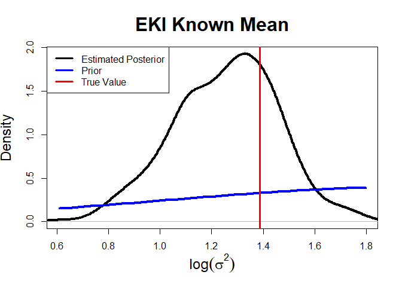<!-- -->

    ## Next temp is 0.0276728588108501
    ## Next temp is 0.0803917209274495
    ## Next temp is 0.147002361563978
    ## Next temp is 0.228578122806248
    ## Next temp is 0.318121776699858
    ## Next temp is 0.409306644493236
    ## Next temp is 0.512640256247794
    ## Next temp is 0.621188890246278
    ## Next temp is 0.719873278292318
    ## Next temp is 0.815401865962801
    ## Next temp is 0.920580405032764
    ## Next temp is 1

<!-- --><!-- -->

    ## Next temp is 0.0129878827154802
    ## Next temp is 0.0706418046942674
    ## Next temp is 0.16352021146757
    ## Next temp is 0.270721184258601
    ## Next temp is 0.38261191266294
    ## Next temp is 0.499628521921065
    ## Next temp is 0.615071029003354
    ## Next temp is 0.72423244029895
    ## Next temp is 0.830436567038404
    ## Next temp is 0.942120324223816
    ## Next temp is 1

<!-- -->

    ## Next temp is 0.0832133427534396
    ## Next temp is 0.171263523451677
    ## Next temp is 0.263047822305005
    ## Next temp is 0.359430754521992
    ## Next temp is 0.459179187649764
    ## Next temp is 0.564120855468607
    ## Next temp is 0.674642395058116
    ## Next temp is 0.764323018660736
    ## Next temp is 0.870553208247941
    ## Next temp is 0.974704792879778
    ## Next temp is 1

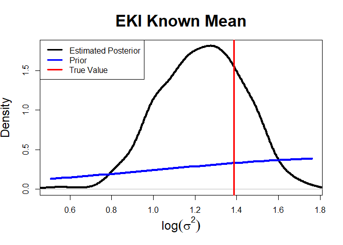<!-- -->

    ## Next temp is 0.0228951440587284
    ## Next temp is 0.0697092352855965
    ## Next temp is 0.135430544551752
    ## Next temp is 0.220617382315078
    ## Next temp is 0.304960259708439
    ## Next temp is 0.406048116973148
    ## Next temp is 0.497967242872763
    ## Next temp is 0.594125271282399
    ## Next temp is 0.706653309624704
    ## Next temp is 0.810867144592677
    ## Next temp is 0.921196402067534
    ## Next temp is 1

<!-- -->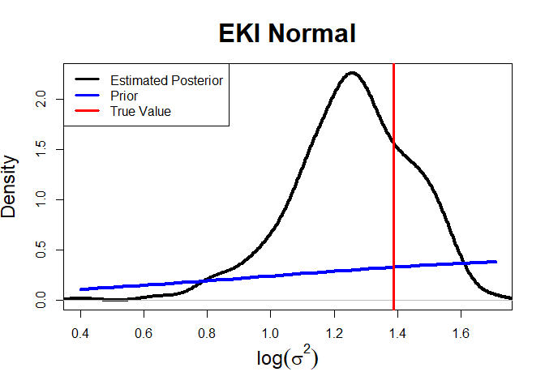<!-- -->

    ## Next temp is 0.00903998733545602
    ## Next temp is 0.0559405901975769
    ## Next temp is 0.148219641466887
    ## Next temp is 0.251102681597217
    ## Next temp is 0.347873055772129
    ## Next temp is 0.450753797010866
    ## Next temp is 0.560582928070395
    ## Next temp is 0.660326159166102
    ## Next temp is 0.766755417773877
    ## Next temp is 0.877801684044387
    ## Next temp is 0.977722906290664
    ## Next temp is 1

<!-- -->

    ## Next temp is 0.0769668760933603
    ## Next temp is 0.167875986642637
    ## Next temp is 0.267624167658601
    ## Next temp is 0.370071000342013
    ## Next temp is 0.458887372441776
    ## Next temp is 0.563623754212229
    ## Next temp is 0.665691492081968
    ## Next temp is 0.777449867036846
    ## Next temp is 0.870957575532839
    ## Next temp is 0.971826234419278
    ## Next temp is 1

<!-- -->

    ## Next temp is 0.0188519934377831
    ## Next temp is 0.0618133842548769
    ## Next temp is 0.124181390920413
    ## Next temp is 0.216530121350264
    ## Next temp is 0.307484559415215
    ## Next temp is 0.401361385310344
    ## Next temp is 0.506317773981436
    ## Next temp is 0.605011978639474
    ## Next temp is 0.695728032707401
    ## Next temp is 0.808718391688566
    ## Next temp is 0.919425558538566
    ## Next temp is 1

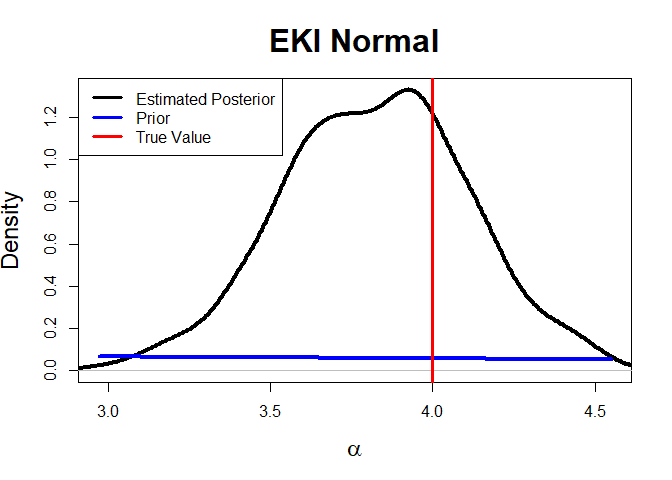<!-- --><!-- -->

    ## Next temp is 0.00481051965574069
    ## Next temp is 0.0288592943001653
    ## Next temp is 0.10149528922701
    ## Next temp is 0.202534293274257
    ## Next temp is 0.310641111653851
    ## Next temp is 0.418269996091124
    ## Next temp is 0.529600934370091
    ## Next temp is 0.639326874810855
    ## Next temp is 0.751191653080483
    ## Next temp is 0.852613910434734
    ## Next temp is 0.955482235670524
    ## Next temp is 1

<!-- -->

    ## Next temp is 0.0862949283681193
    ## Next temp is 0.174872018071869
    ## Next temp is 0.264321487114506
    ## Next temp is 0.365446707348329
    ## Next temp is 0.460926349245908
    ## Next temp is 0.564989676950729
    ## Next temp is 0.665885730289329
    ## Next temp is 0.777839718846744
    ## Next temp is 0.881713996247175
    ## Next temp is 0.983710532181554
    ## Next temp is 1

<!-- -->

    ## Next temp is 0.0121545208143225
    ## Next temp is 0.0515698532804346
    ## Next temp is 0.110364548799543
    ## Next temp is 0.18444858246283
    ## Next temp is 0.263757708795057
    ## Next temp is 0.354938768229941
    ## Next temp is 0.444389523038725
    ## Next temp is 0.545027028088874
    ## Next temp is 0.660382995894071
    ## Next temp is 0.742715379464075
    ## Next temp is 0.848433879220108
    ## Next temp is 0.953648482800776
    ## Next temp is 1

<!-- --><!-- -->

    ## Next temp is 0.00392437348995118
    ## Next temp is 0.0207687758622293
    ## Next temp is 0.0840524609219343
    ## Next temp is 0.185113611258354
    ## Next temp is 0.283387176680532
    ## Next temp is 0.381445086673861
    ## Next temp is 0.484299355962149
    ## Next temp is 0.594181754160825
    ## Next temp is 0.70151811703869
    ## Next temp is 0.815160363982784
    ## Next temp is 0.909185456748954
    ## Next temp is 1

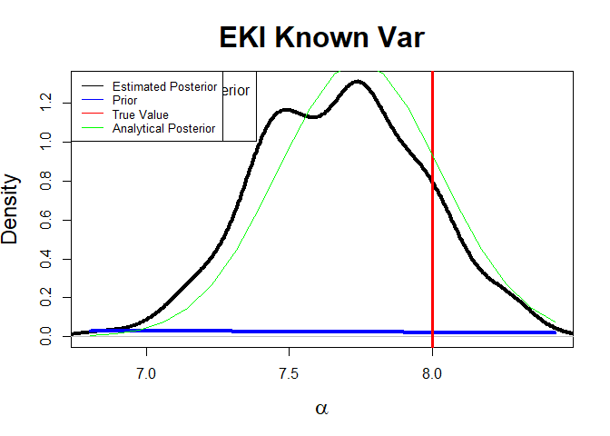<!-- -->

    ## Next temp is 0.112734221123177
    ## Next temp is 0.198591044779741
    ## Next temp is 0.299974085606501
    ## Next temp is 0.404783181427999
    ## Next temp is 0.505454397691458
    ## Next temp is 0.609867152515629
    ## Next temp is 0.714756570389241
    ## Next temp is 0.810489347671288
    ## Next temp is 0.91938403131375
    ## Next temp is 1

<!-- -->

    ## Next temp is 0.00707088804034319
    ## Next temp is 0.0275365685521558
    ## Next temp is 0.0759089641921266
    ## Next temp is 0.141313197409512
    ## Next temp is 0.222387811677421
    ## Next temp is 0.306791522306974
    ## Next temp is 0.402167137234148
    ## Next temp is 0.48697423951052
    ## Next temp is 0.584749608078343
    ## Next temp is 0.682961273007286
    ## Next temp is 0.785368303166272
    ## Next temp is 0.879993414291047
    ## Next temp is 0.975040580504219
    ## Next temp is 1

<!-- --><!-- -->

    ## Next temp is 0.00224956770823401
    ## Next temp is 0.009119363003851
    ## Next temp is 0.0341818826722563
    ## Next temp is 0.101998135322085
    ## Next temp is 0.183602444480266
    ## Next temp is 0.267387538980754
    ## Next temp is 0.365223796260788
    ## Next temp is 0.47952785091626
    ## Next temp is 0.578775638083091
    ## Next temp is 0.678908875806258
    ## Next temp is 0.778098057642755
    ## Next temp is 0.88588324798808
    ## Next temp is 0.995825692354769
    ## Next temp is 1

<!-- -->

    ## Next temp is 0.0900202015733004
    ## Next temp is 0.180273556340941
    ## Next temp is 0.279217825013231
    ## Next temp is 0.383703585728214
    ## Next temp is 0.473560393907433
    ## Next temp is 0.577160562503266
    ## Next temp is 0.677891787012191
    ## Next temp is 0.774770271380207
    ## Next temp is 0.885768041089226
    ## Next temp is 0.997935296919105
    ## Next temp is 1

<!-- -->

    ## Next temp is 0.00591735862266043
    ## Next temp is 0.0202015672518246
    ## Next temp is 0.046371583711864
    ## Next temp is 0.0981261146127842
    ## Next temp is 0.179480685001512
    ## Next temp is 0.267425169477797
    ## Next temp is 0.362086961832326
    ## Next temp is 0.45383905264516
    ## Next temp is 0.551586200242775
    ## Next temp is 0.650590353817878
    ## Next temp is 0.753833705168394
    ## Next temp is 0.844811972653725
    ## Next temp is 0.959874409716922
    ## Next temp is 1

<!-- --><!-- -->

All EKI models do well at estimating the mean parameter. There is no
change in how the noise parameter is being estimated across a range of
$\alpha$ values, which is not surprising since the covariance matrices
used to update the particles should not depend on $\alpha$.

## Changing $\sigma^2$

In this experiment I change the true value of $\sigma$ from $2$ to $10$
in increments of $2$. The purpose of this is to determine whether the
EKI algorithm can detect values of $\sigma$ which are further away from
the prior. Additionally, we would expect the $\alpha$ particles to
become more diffuse as the true value of $\sigma$ increases.

``` r
sigma_seq <- seq(0.5, 8.5, length.out = 5)
num_dimensions <- 50
num_particles <- 400
for (sigma in sigma_seq) {

  true_parameters <- list(alpha = 2, sigma = sigma, x = rep(1, num_dimensions))
  generate_results(num_particles, true_parameters)
}
```

    ## Next temp is 0.000763885513674094
    ## Next temp is 0.00664645684118037
    ## Next temp is 0.0443695616301877
    ## Next temp is 0.127300958827292
    ## Next temp is 0.235206466053864
    ## Next temp is 0.330228725239477
    ## Next temp is 0.431820231095465
    ## Next temp is 0.53152680051785
    ## Next temp is 0.634479639280615
    ## Next temp is 0.734180340824235
    ## Next temp is 0.828923610755109
    ## Next temp is 0.930218100480663
    ## Next temp is 1

<!-- -->

    ## Next temp is 0.0692329921286367
    ## Next temp is 0.122637716752931
    ## Next temp is 0.171496258081322
    ## Next temp is 0.229101358693852
    ## Next temp is 0.291710301419823
    ## Next temp is 0.353672987246681
    ## Next temp is 0.423959260797079
    ## Next temp is 0.500347194544228
    ## Next temp is 0.599885339536975
    ## Next temp is 0.688517185305412
    ## Next temp is 0.782647479785803
    ## Next temp is 0.886470285806733
    ## Next temp is 0.991410009273565
    ## Next temp is 1

<!-- -->

    ## Next temp is 0.0244687301863017
    ## Next temp is 0.0634556325529406
    ## Next temp is 0.108793501509773
    ## Next temp is 0.152456187010228
    ## Next temp is 0.197065671669399
    ## Next temp is 0.245402956021591
    ## Next temp is 0.299896006629094
    ## Next temp is 0.358793983408614
    ## Next temp is 0.433593168256741
    ## Next temp is 0.514499342538528
    ## Next temp is 0.593708697540179
    ## Next temp is 0.682839990589547
    ## Next temp is 0.778458113641932
    ## Next temp is 0.881518732358769
    ## Next temp is 0.986074424770669
    ## Next temp is 1

<!-- -->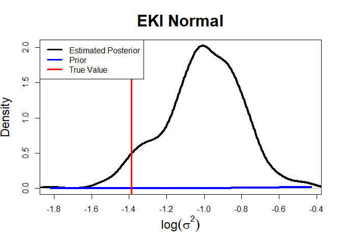<!-- -->

    ## Next temp is 0.0180253730240908
    ## Next temp is 0.0722449624853863
    ## Next temp is 0.162081289710643
    ## Next temp is 0.260994529639719
    ## Next temp is 0.357549844859901
    ## Next temp is 0.457699671917042
    ## Next temp is 0.564193652690809
    ## Next temp is 0.667148094270993
    ## Next temp is 0.775657157577735
    ## Next temp is 0.875896476241552
    ## Next temp is 0.984376270851814
    ## Next temp is 1

<!-- -->

    ## Next temp is 0.0989715455690703
    ## Next temp is 0.201358154270503
    ## Next temp is 0.29978601859301
    ## Next temp is 0.403392233835433
    ## Next temp is 0.511727934476642
    ## Next temp is 0.599212935166911
    ## Next temp is 0.708469830214258
    ## Next temp is 0.822030107101094
    ## Next temp is 0.925504821356891
    ## Next temp is 1

<!-- -->

    ## Next temp is 0.0200380466965375
    ## Next temp is 0.0750622199704373
    ## Next temp is 0.161134710532248
    ## Next temp is 0.249886203725307
    ## Next temp is 0.336446092760351
    ## Next temp is 0.435505031321963
    ## Next temp is 0.535553280683261
    ## Next temp is 0.633455477382137
    ## Next temp is 0.744262505871961
    ## Next temp is 0.856457680139158
    ## Next temp is 0.975273278878987
    ## Next temp is 1

<!-- -->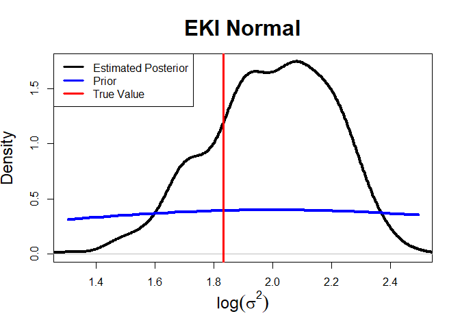<!-- -->

    ## Next temp is 0.0471364546439534
    ## Next temp is 0.127851339312395
    ## Next temp is 0.207584077677935
    ## Next temp is 0.296967051069422
    ## Next temp is 0.39999099601549
    ## Next temp is 0.508003711712796
    ## Next temp is 0.611101467942676
    ## Next temp is 0.718216891079883
    ## Next temp is 0.816765150582796
    ## Next temp is 0.920101354474682
    ## Next temp is 1

<!-- -->

    ## Next temp is 0.0690402068370357
    ## Next temp is 0.150005252673385
    ## Next temp is 0.239382363599111
    ## Next temp is 0.334670858321005
    ## Next temp is 0.439826824207049
    ## Next temp is 0.537097917357701
    ## Next temp is 0.63141241918529
    ## Next temp is 0.734982611915697
    ## Next temp is 0.841997233736513
    ## Next temp is 0.945910246786023
    ## Next temp is 1

<!-- -->

    ## Next temp is 0.0251661614185268
    ## Next temp is 0.0905005901564971
    ## Next temp is 0.169703292100561
    ## Next temp is 0.248519849020327
    ## Next temp is 0.333805269402374
    ## Next temp is 0.433497698282829
    ## Next temp is 0.53480959338109
    ## Next temp is 0.646397234675751
    ## Next temp is 0.7425366481975
    ## Next temp is 0.848864391265605
    ## Next temp is 0.953881347491996
    ## Next temp is 1

<!-- -->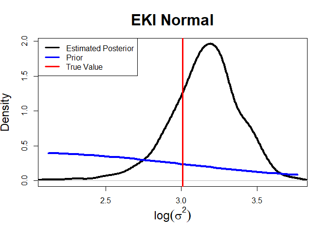<!-- -->

    ## Next temp is 0.0675894833438997
    ## Next temp is 0.163153300537549
    ## Next temp is 0.26725637682432
    ## Next temp is 0.378888008902236
    ## Next temp is 0.477747669414492
    ## Next temp is 0.584636279875655
    ## Next temp is 0.700976090080017
    ## Next temp is 0.805736744199586
    ## Next temp is 0.89787804909647
    ## Next temp is 1

<!-- -->

    ## Next temp is 0.0538463623945922
    ## Next temp is 0.11048967438197
    ## Next temp is 0.19869608166575
    ## Next temp is 0.28677921645178
    ## Next temp is 0.376073407613035
    ## Next temp is 0.489280751363928
    ## Next temp is 0.581831391060277
    ## Next temp is 0.673597562935344
    ## Next temp is 0.778191058630429
    ## Next temp is 0.881722471366612
    ## Next temp is 0.97566343515283
    ## Next temp is 1

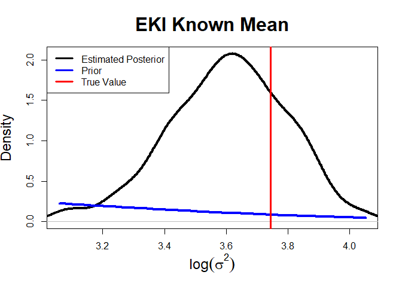<!-- -->

    ## Next temp is 0.0241140645079576
    ## Next temp is 0.0746473053668365
    ## Next temp is 0.157058917851973
    ## Next temp is 0.243380410144875
    ## Next temp is 0.34235179615818
    ## Next temp is 0.453456573123344
    ## Next temp is 0.546981543428304
    ## Next temp is 0.648485461418633
    ## Next temp is 0.753339739792429
    ## Next temp is 0.861487118196406
    ## Next temp is 0.963995182215344
    ## Next temp is 1

<!-- --><!-- -->

    ## Next temp is 0.0829610316300877
    ## Next temp is 0.176413595606184
    ## Next temp is 0.275815857294752
    ## Next temp is 0.383537997622338
    ## Next temp is 0.497958873366767
    ## Next temp is 0.613667924951551
    ## Next temp is 0.733363082325857
    ## Next temp is 0.846785920077448
    ## Next temp is 0.956240594222843
    ## Next temp is 1

<!-- -->

    ## Next temp is 0.0460181227078222
    ## Next temp is 0.119663984683904
    ## Next temp is 0.195708656168264
    ## Next temp is 0.276540479178438
    ## Next temp is 0.374502913781108
    ## Next temp is 0.4727353078368
    ## Next temp is 0.578333475101166
    ## Next temp is 0.666885018279745
    ## Next temp is 0.777934947458642
    ## Next temp is 0.872948890591463
    ## Next temp is 0.974076750714968
    ## Next temp is 1

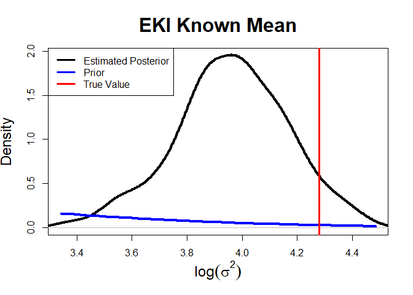<!-- -->

    ## Next temp is 0.0285419126950443
    ## Next temp is 0.0745113203392961
    ## Next temp is 0.152846854569084
    ## Next temp is 0.227393170383946
    ## Next temp is 0.305814252630526
    ## Next temp is 0.405931023060965
    ## Next temp is 0.499919406115587
    ## Next temp is 0.608300142745025
    ## Next temp is 0.707665179125531
    ## Next temp is 0.806997976602947
    ## Next temp is 0.907951548055402
    ## Next temp is 1

<!-- --><!-- -->

We see that the EKI method is able to estimate $\sigma^2$ quite well,
even as it gets larger. The particles for $\alpha$ are more diffuse as
$\sigma^2$ increases, which is what we naturally expect.

## Changing Number of Particles

Finally I change the number of particles used for the EKI algorithm. The
main purpose of this is to check that the EKI model with known variance
concentrates around the true posterior distribution.

``` r
num_dimensions <- 50
particle_seq <- c(100, 500, 1000) 
true_parameters <- list(alpha = 2, sigma = 2, x = rep(1, num_dimensions))

for (num_particles in particle_seq) {
  generate_results(num_particles, true_parameters)
}
```

    ## Next temp is 0.0162936012357233
    ## Next temp is 0.0578933204771728
    ## Next temp is 0.107789518786991
    ## Next temp is 0.169759306380969
    ## Next temp is 0.232405672682006
    ## Next temp is 0.287805287999264
    ## Next temp is 0.350017973466134
    ## Next temp is 0.402449319484082
    ## Next temp is 0.476684019274421
    ## Next temp is 0.560485759525163
    ## Next temp is 0.620980646518144
    ## Next temp is 0.687788922839731
    ## Next temp is 0.757004766169132
    ## Next temp is 0.814450109844618
    ## Next temp is 0.902895549299001
    ## Next temp is 0.960352358586721
    ## Next temp is 1

<!-- -->

    ## Next temp is 0.0519614982451181
    ## Next temp is 0.126290917962524
    ## Next temp is 0.191599022203057
    ## Next temp is 0.266063773295399
    ## Next temp is 0.379445908526717
    ## Next temp is 0.462370395810231
    ## Next temp is 0.543046222427527
    ## Next temp is 0.633660136725423
    ## Next temp is 0.717829045944452
    ## Next temp is 0.778621637228443
    ## Next temp is 0.88216719958181
    ## Next temp is 0.965376555067331
    ## Next temp is 1

<!-- -->

    ## Next temp is 0.0133099256496036
    ## Next temp is 0.0526942631273249
    ## Next temp is 0.135028900077579
    ## Next temp is 0.211369473580489
    ## Next temp is 0.277802464085949
    ## Next temp is 0.366065647477372
    ## Next temp is 0.436294708321387
    ## Next temp is 0.501586190309348
    ## Next temp is 0.57344033473431
    ## Next temp is 0.641284215127418
    ## Next temp is 0.703648818175888
    ## Next temp is 0.7850416013497
    ## Next temp is 0.866125639395453
    ## Next temp is 0.971369680726657
    ## Next temp is 1

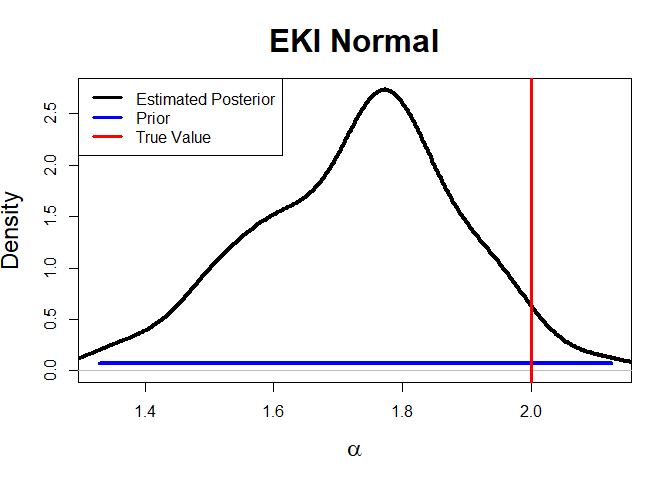<!-- --><!-- -->

    ## Next temp is 0.0165739003843896
    ## Next temp is 0.0756790223000769
    ## Next temp is 0.173576360040411
    ## Next temp is 0.276173671624764
    ## Next temp is 0.39348080162349
    ## Next temp is 0.508979752686052
    ## Next temp is 0.618999037998813
    ## Next temp is 0.728719475790784
    ## Next temp is 0.834252991653772
    ## Next temp is 0.946118567915418
    ## Next temp is 1

<!-- -->

    ## Next temp is 0.0977759334695917
    ## Next temp is 0.184386371493036
    ## Next temp is 0.28446765130456
    ## Next temp is 0.376890179142522
    ## Next temp is 0.47840016958567
    ## Next temp is 0.584540386612216
    ## Next temp is 0.685453900988862
    ## Next temp is 0.805549266045975
    ## Next temp is 0.904144275034232
    ## Next temp is 1

<!-- -->

    ## Next temp is 0.0285766566255212
    ## Next temp is 0.079451153642206
    ## Next temp is 0.154037167638858
    ## Next temp is 0.239465270432569
    ## Next temp is 0.322785741584102
    ## Next temp is 0.415455775160454
    ## Next temp is 0.507807769679439
    ## Next temp is 0.615853122226407
    ## Next temp is 0.71740319577784
    ## Next temp is 0.816568296649854
    ## Next temp is 0.919307034177525
    ## Next temp is 1

<!-- --><!-- -->

    ## Next temp is 0.0157902661438172
    ## Next temp is 0.0798543002244838
    ## Next temp is 0.166946569908293
    ## Next temp is 0.266621161890989
    ## Next temp is 0.370998603808112
    ## Next temp is 0.47368372511592
    ## Next temp is 0.56917639884946
    ## Next temp is 0.66574988112484
    ## Next temp is 0.765138521894509
    ## Next temp is 0.866858572581512
    ## Next temp is 0.9750739670459
    ## Next temp is 1

<!-- -->

    ## Next temp is 0.0995300701309496
    ## Next temp is 0.205293431263116
    ## Next temp is 0.306324778266875
    ## Next temp is 0.419218592548029
    ## Next temp is 0.524007925706184
    ## Next temp is 0.631137630597979
    ## Next temp is 0.740042861952
    ## Next temp is 0.845601757563893
    ## Next temp is 0.94818001645803
    ## Next temp is 1

<!-- -->

    ## Next temp is 0.0290473602903193
    ## Next temp is 0.0906460980779622
    ## Next temp is 0.168381406746238
    ## Next temp is 0.257405593183748
    ## Next temp is 0.348052733706831
    ## Next temp is 0.451337905619725
    ## Next temp is 0.560886192084698
    ## Next temp is 0.666825999756316
    ## Next temp is 0.773733058602636
    ## Next temp is 0.880374020946118
    ## Next temp is 0.982525088595153
    ## Next temp is 1

<!-- -->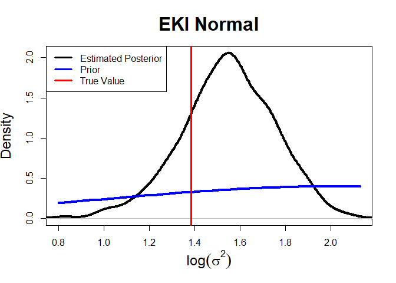<!-- -->

Indeed we find that this is the case.

## Conclusion

To summarize, GEKI does well at estimating both parameters when we use
summary statistics. This is interesting considering it doesn’t do well
when using the full data.
