Generalised Ensemble Kalman Inversion - Multivariate Normal Model
================
Owen Jackson
2025-01-15

# Results For Multivariate Normal Model

## Import Functions

### External Packages

``` r
pacman::p_load(pacman, purrr, mvtnorm, mcmc, MASS, glue)
```

### Algorithms

``` r
source('C:/Users/owenj/OneDrive/Uni/Vacation Scholarship/GEKI_Vacation_Scholarship/src/eki.R')
source('C:/Users/owenj/OneDrive/Uni/Vacation Scholarship/GEKI_Vacation_Scholarship/src/mcmc_normal.R')
source('C:/Users/owenj/OneDrive/Uni/Vacation Scholarship/GEKI_Vacation_Scholarship/src/mcmc_lognormal.R')
```

### Models

``` r
# MVN Normal
source('C:/Users/owenj/OneDrive/Uni/Vacation Scholarship/GEKI_Vacation_Scholarship/src/models/mvn_normal/eki_normal.R')
source('C:/Users/owenj/OneDrive/Uni/Vacation Scholarship/GEKI_Vacation_Scholarship/src/models/mvn_normal/eki_normal_known_var.R')
source('C:/Users/owenj/OneDrive/Uni/Vacation Scholarship/GEKI_Vacation_Scholarship/src/models/mvn_normal/eki_normal_known_mean.R')
# MVN Lognormal
source('C:/Users/owenj/OneDrive/Uni/Vacation Scholarship/GEKI_Vacation_Scholarship/src/models/mvn_lognormal/eki_lognormal.R')
source('C:/Users/owenj/OneDrive/Uni/Vacation Scholarship/GEKI_Vacation_Scholarship/src/models/mvn_lognormal/eki_lognormal_var_only.R')
```

### Sampling and PDFs

``` r
source('C:/Users/owenj/OneDrive/Uni/Vacation Scholarship/GEKI_Vacation_Scholarship/src/pdfs/pdfs_normal.R')
source('C:/Users/owenj/OneDrive/Uni/Vacation Scholarship/GEKI_Vacation_Scholarship/src/pdfs/pdfs_lognormal.R')
source('C:/Users/owenj/OneDrive/Uni/Vacation Scholarship/GEKI_Vacation_Scholarship/src/samples/samples_normal.R')
source('C:/Users/owenj/OneDrive/Uni/Vacation Scholarship/GEKI_Vacation_Scholarship/src/samples/samples_lognormal.R')
```

### Utils

``` r
source('C:/Users/owenj/OneDrive/Uni/Vacation Scholarship/GEKI_Vacation_Scholarship/src/utils/tempering.R')
source('C:/Users/owenj/OneDrive/Uni/Vacation Scholarship/GEKI_Vacation_Scholarship/src/utils/eki_helper.R')
source('C:/Users/owenj/OneDrive/Uni/Vacation Scholarship/GEKI_Vacation_Scholarship/results/plots_normal.R')
```

``` r
generate_results <- function(num_particles, true_parameters) {
  
  true_data <- likelihood_normal(true_parameters)
  
  # Model 1
  eki_result_known_var <- eki_normal_known_var(num_particles, true_data, true_parameters, 
                                               prior_params, adaptive = adaptive)
  plot_eki_normal_known_var(eki_result_known_var, true_data, 
                            true_parameters, prior_params)
  
  # Model 2
  eki_result_known_mean <- eki_normal_known_mean(num_particles, true_data, true_parameters, 
                                                 prior_params, adaptive = adaptive)
  plot_eki_normal_known_mean(eki_result_known_mean, true_parameters, prior_params)
  
  # Model 3
  eki_result <- eki_normal(num_particles, true_data, true_parameters, 
                           prior_params, adaptive = adaptive)
  plot_eki_normal(eki_result, true_parameters, prior_params)
  
  # MCMC Comparison for Model 3
  run.1 <- normal_mcmc(true_data, true_parameters, prior_params)
  chain.1 <- run.1$batch
  run.2 <- normal_mcmc(true_data, true_parameters, prior_params)
  chain.2 <- run.2$batch
  plot_mcmc_trace_plots(chain.1, chain.2, burnin = 500)
  plot_mcmc_histogram(chain.1, chain.2, true_parameters, prior_params, 
                      burnin = 500)
  
  plot_overlay(eki_result, chain.1, chain.2, true_parameters, prior_params)
  
}
```

``` r
generate_lognormal_results <- function(num_particles, true_parameters, prior_params) {
  
  true_data <- likelihood_lognormal(true_parameters)

  # Model 2
  eki_result_known_mean <- eki_lognormal_var_only(num_particles, true_data, 
                                                 true_parameters,
                                                 prior_params, adaptive = adaptive)
  plot_eki_normal_known_mean(eki_result_known_mean, true_parameters, prior_params)
  
  # Model 3
  eki_result <- eki_lognormal(num_particles, true_data, true_parameters, 
                           prior_params, adaptive = adaptive)
  plot_eki_normal(eki_result, true_parameters, prior_params)
  
  # Correlation between particles
  alpha_particles <- eki_result$particles[, 1]
  sigma2_particles <- exp(eki_result$particles[, 2])
  
  plot(alpha_particles, sigma2_particles)
  
  # MCMC Comparison for Model 3
  run.1 <- lognormal_mcmc(true_data, true_parameters, prior_params)
  chain.1 <- run.1$batch
  run.2 <- lognormal_mcmc(true_data, true_parameters, prior_params)
  chain.2 <- run.2$batch
  plot_mcmc_trace_plots(chain.1, chain.2, burnin = 500)
  plot_mcmc_histogram(chain.1, chain.2, true_parameters, prior_params,
                      burnin = 500)
  
}
```

## The Model

We assume that we have access to a single observation from a
multivariate normal distribution $y \sim N(\alpha x, \sigma^2I)$ where
$\alpha$ is a scalar and $x$ is a known vector.

I look at three variations of this model

- The variance is known, but the mean is not $\theta = \alpha$

- The mean is known, but the variance is not $\theta = \sigma^2$

- Both parameters are unknown $\theta = (\alpha, \sigma^2)$.

I look at a range of combinations of $\alpha, x$ and $\sigma^2$,
comparing against MCMC sampling. Of particular interest is how well GEKI
is able to estimate the noise parameter, since previous EKI algorithms
require the noise parameter to be known.

### Priors

In all combinations we draw from the same priors (if that parameter is
considered unknown):

- $\alpha \sim ~ N(0, 5^2)$

- $\log(\sigma^2) \sim N(2, 1^2)$

``` r
prior_params <- list(alpha.mean = 0, alpha.sd = 5, 
                     sigma2.mean = 2, sigma2.sd = 1)
```

### Adaptive Tempering

``` r
adaptive = TRUE
```

### Output

For each variation of the model, I plot the EKI histograms of the
particles against their prior. In the known mean, unknown variance case,
I also plot the posterior since there is an analytical posterior in this
special case. This serves as a check that the algorithm has been
implemented correctly.

## Changing Number of Dimensions

In this experiment I keep $\alpha$ and $\sigma^2$ fixed at 2 and 4
respectively and let $x$ be a vector of 1s corresponding to 10, 50 and
100 dimensions. I keep the number of particles fixed at 400. The purpose
of this is to see how the EKI algorithm performs when the number of
dimensions increases.

``` r
num_dimensions <- c(10, 50, 100)
num_particles <- 400
for (dimension in num_dimensions) {
  true_parameters <- list(alpha = 2, sigma = 2, x = rep(1, dimension))
  generate_results(num_particles, true_parameters)
}
```

    ## Next temp is 0.0911797951233316
    ## Next temp is 0.842981531964299
    ## Next temp is 1

<!-- -->

    ## Next temp is 1

<!-- -->

    ## Next temp is 0.161112897039097
    ## Next temp is 0.547065506561839
    ## Next temp is 1

<!-- -->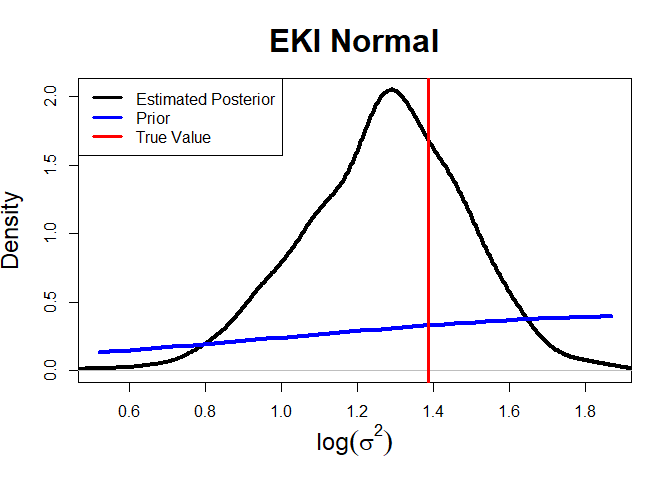<!-- --><!-- --><!-- --><!-- --><!-- --><!-- --><!-- -->

    ## Next temp is 0.016069280018122
    ## Next temp is 0.135821080172291
    ## Next temp is 1

<!-- -->

    ## Next temp is 0.224643576697497
    ## Next temp is 0.457986785489575
    ## Next temp is 0.648422321619787
    ## Next temp is 0.840622636989343
    ## Next temp is 1

<!-- -->

    ## Next temp is 0.0339065708547005
    ## Next temp is 0.126010222627405
    ## Next temp is 0.267538523234582
    ## Next temp is 0.445993162357896
    ## Next temp is 0.639510685686898
    ## Next temp is 0.862925897624399
    ## Next temp is 1

<!-- --><!-- --><!-- --><!-- --><!-- --><!-- --><!-- -->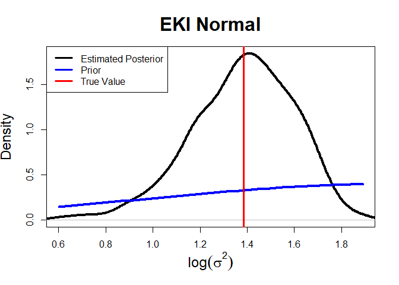<!-- -->

    ## Next temp is 0.00912659952885839
    ## Next temp is 0.0894726355044459
    ## Next temp is 0.978053306965139
    ## Next temp is 1

<!-- -->

    ## Next temp is 0.11989615498706
    ## Next temp is 0.232477040357825
    ## Next temp is 0.348320993531644
    ## Next temp is 0.469500730281296
    ## Next temp is 0.591850070453619
    ## Next temp is 0.708961653568909
    ## Next temp is 0.83076683344296
    ## Next temp is 0.964927041163797
    ## Next temp is 1

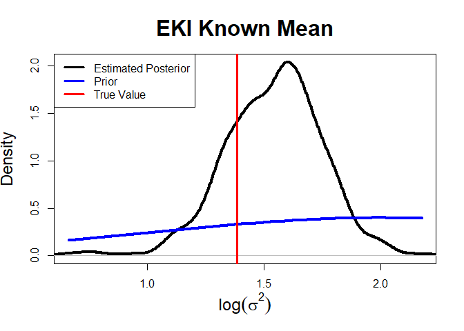<!-- -->

    ## Next temp is 0.0137585403231808
    ## Next temp is 0.0560582646422561
    ## Next temp is 0.130915933907135
    ## Next temp is 0.225215475975704
    ## Next temp is 0.33505823290484
    ## Next temp is 0.446395003617527
    ## Next temp is 0.576041854720988
    ## Next temp is 0.714635475220063
    ## Next temp is 0.868003682392267
    ## Next temp is 1

<!-- -->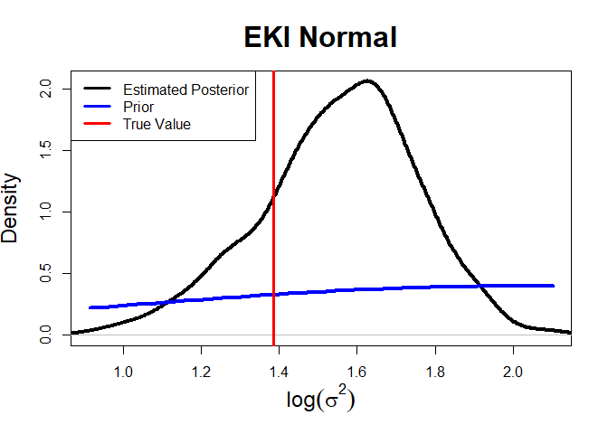<!-- --><!-- -->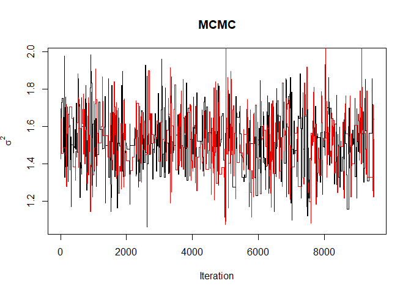<!-- --><!-- -->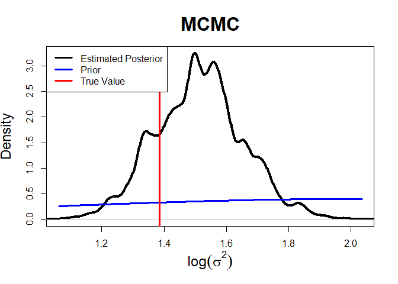<!-- --><!-- -->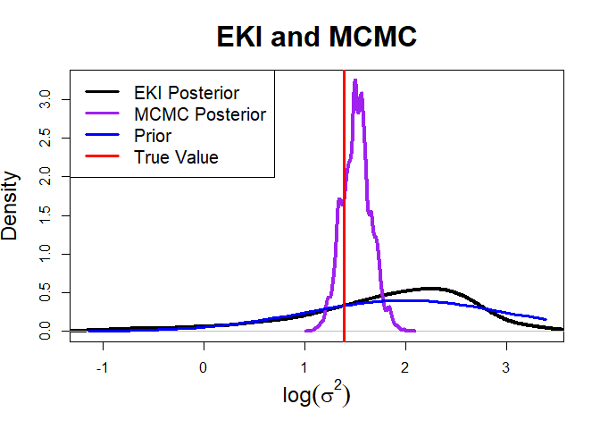<!-- -->

Overall, EKI covers both parameters quite well in this scenario.
However, it is worth noting that the prior for $\sigma^2$ already covers
the true parameter well and that the $\sigma^2$ particles have not
shifted significantly from their prior distribution. By contrast MCMC
concentrates well for both parameters and we can see a noticeable shift
from the prior distribution.

## Changing $\alpha$

In this experiment, I keep $\sigma^2$ fixed at 4, make $x$ a
50-dimensional vector of 1s and change $\alpha$ from 0 to 10 in
increments of 2. The purpose of this is to make sure that the EKI
algorithm is accurate across of range of $\alpha$ and if it changes how
the noise parameter is estimated.

``` r
alpha_seq <- seq(0, 10, length.out = 6)
num_dimensions <- 50 
num_particles <- 400
for (alpha in alpha_seq) {    
  true_parameters <- list(alpha = alpha, sigma = 2, x = rep(1, num_dimensions))   
  generate_results(num_particles, true_parameters)
}
```

    ## Next temp is 0.0181167186303167
    ## Next temp is 0.153268539207235
    ## Next temp is 1

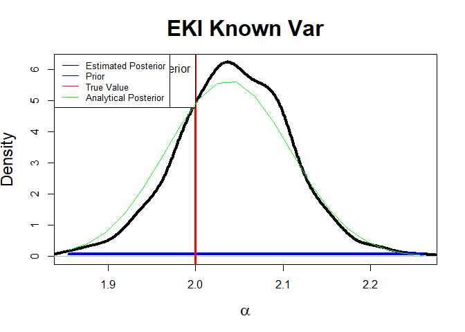<!-- -->

    ## Next temp is 0.164480246799454
    ## Next temp is 0.319556819984466
    ## Next temp is 0.475675612392777
    ## Next temp is 0.622015223877568
    ## Next temp is 0.771106545927447
    ## Next temp is 0.92005854996477
    ## Next temp is 1

<!-- -->

    ## Next temp is 0.0282792112620427
    ## Next temp is 0.101834863531359
    ## Next temp is 0.206698679083937
    ## Next temp is 0.340137473017323
    ## Next temp is 0.488395081986282
    ## Next temp is 0.644537497103889
    ## Next temp is 0.803140101439916
    ## Next temp is 0.975265543716846
    ## Next temp is 1

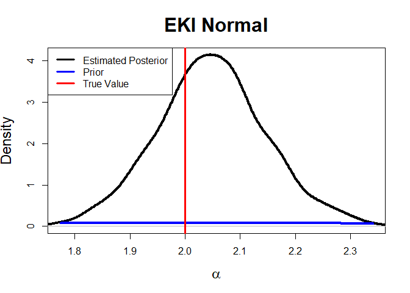<!-- --><!-- --><!-- --><!-- --><!-- --><!-- --><!-- -->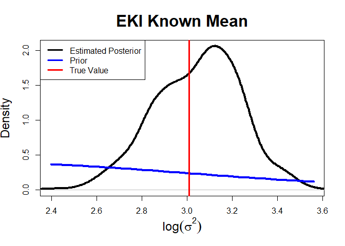<!-- -->

    ## Next temp is 0.0225251277882561
    ## Next temp is 0.193544705724962
    ## Next temp is 1

<!-- -->

    ## Next temp is 0.192741009131242
    ## Next temp is 0.396806055078326
    ## Next temp is 0.600076792770304
    ## Next temp is 0.822430318036326
    ## Next temp is 1

<!-- -->

    ## Next temp is 0.030596419394201
    ## Next temp is 0.11239980065089
    ## Next temp is 0.235239891956282
    ## Next temp is 0.395868578439341
    ## Next temp is 0.581836182102476
    ## Next temp is 0.779655860456774
    ## Next temp is 0.991137032559253
    ## Next temp is 1

<!-- --><!-- -->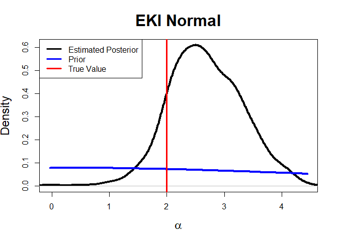<!-- --><!-- --><!-- --><!-- --><!-- --><!-- -->

    ## Next temp is 0.0100900205983936
    ## Next temp is 0.0970200296925067
    ## Next temp is 0.687510799746091
    ## Next temp is 1

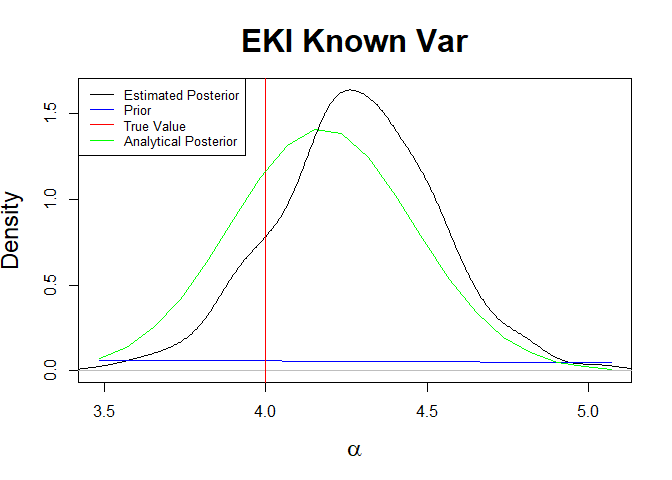<!-- -->

    ## Next temp is 0.146855443807744
    ## Next temp is 0.284944275368467
    ## Next temp is 0.431326900043911
    ## Next temp is 0.583699599771318
    ## Next temp is 0.733178090266888
    ## Next temp is 0.877103980645968
    ## Next temp is 1

<!-- -->

    ## Next temp is 0.0225165945006217
    ## Next temp is 0.0763489041078654
    ## Next temp is 0.164582504863774
    ## Next temp is 0.261842640785304
    ## Next temp is 0.372550907597847
    ## Next temp is 0.497311752662093
    ## Next temp is 0.619206403678253
    ## Next temp is 0.742903540460458
    ## Next temp is 0.871509236356396
    ## Next temp is 1

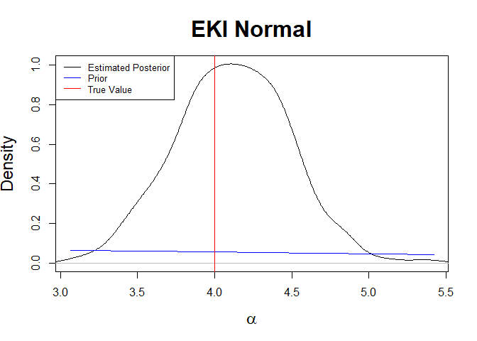<!-- --><!-- --><!-- --><!-- -->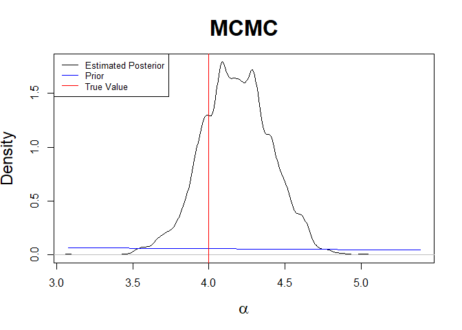<!-- -->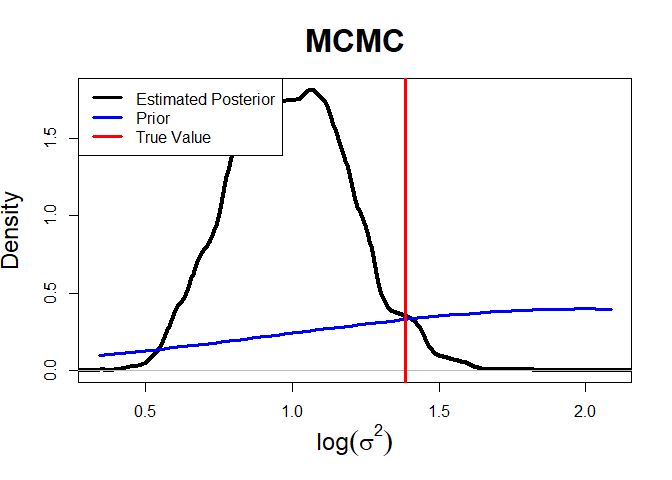<!-- -->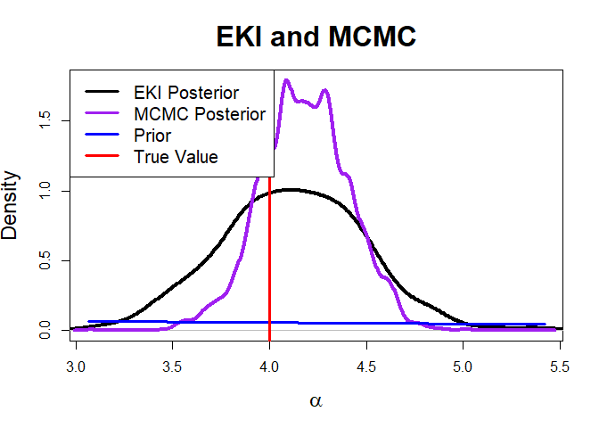<!-- --><!-- -->

    ## Next temp is 0.00734191631041378
    ## Next temp is 0.0490943298683931
    ## Next temp is 0.519559153769544
    ## Next temp is 1

<!-- -->

    ## Next temp is 0.269538037524706
    ## Next temp is 0.572347934784107
    ## Next temp is 0.884498025097452
    ## Next temp is 1

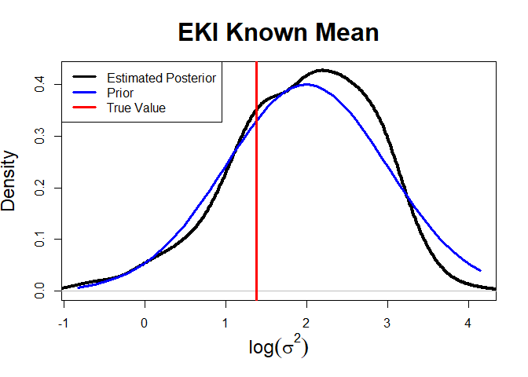<!-- -->

    ## Next temp is 0.0134992466447428
    ## Next temp is 0.0660318799782842
    ## Next temp is 0.175513911124
    ## Next temp is 0.328510166600468
    ## Next temp is 0.506685659771008
    ## Next temp is 0.712767479573737
    ## Next temp is 0.941685774358075
    ## Next temp is 1

<!-- -->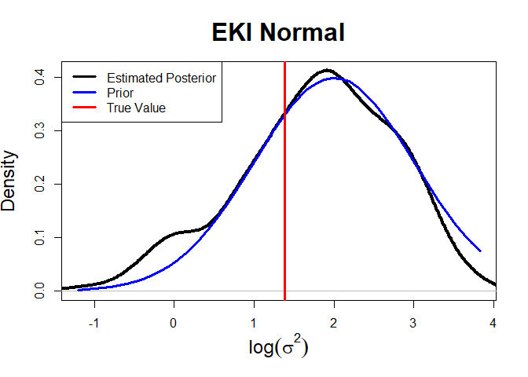<!-- -->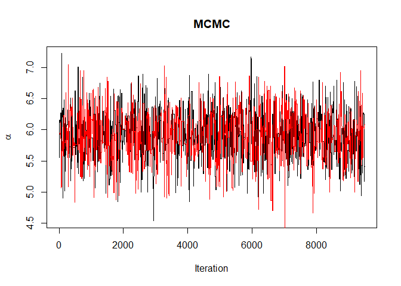<!-- --><!-- -->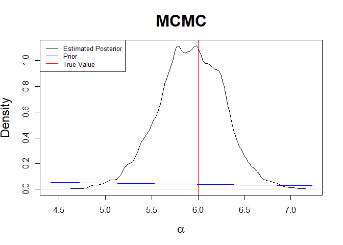<!-- --><!-- -->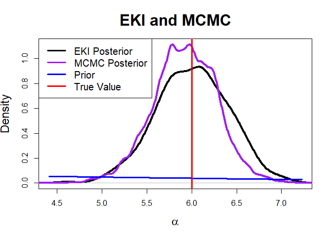<!-- -->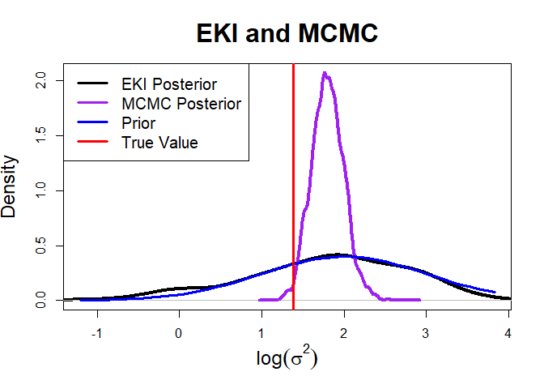<!-- -->

    ## Next temp is 0.0039681489888005
    ## Next temp is 0.025505671893086
    ## Next temp is 0.169422097472222
    ## Next temp is 1

<!-- -->

    ## Next temp is 0.189974830674523
    ## Next temp is 0.400325566304353
    ## Next temp is 0.602430190782977
    ## Next temp is 0.791647450745403
    ## Next temp is 1

<!-- -->

    ## Next temp is 0.00803698372376548
    ## Next temp is 0.0366661868244726
    ## Next temp is 0.103739678919798
    ## Next temp is 0.220929613867193
    ## Next temp is 0.373941571998895
    ## Next temp is 0.551474200452155
    ## Next temp is 0.739282692617018
    ## Next temp is 0.950382139561315
    ## Next temp is 1

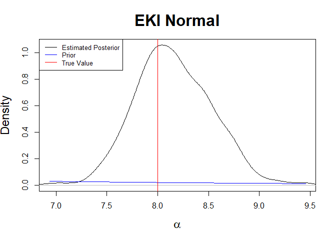<!-- -->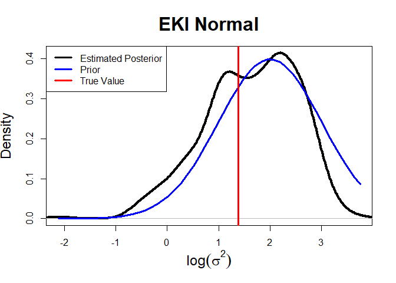<!-- -->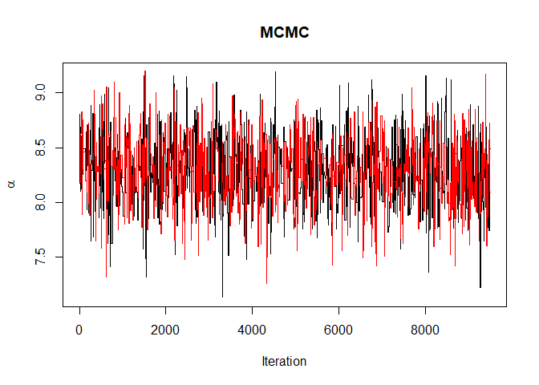<!-- --><!-- --><!-- -->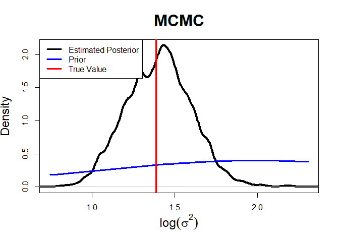<!-- --><!-- -->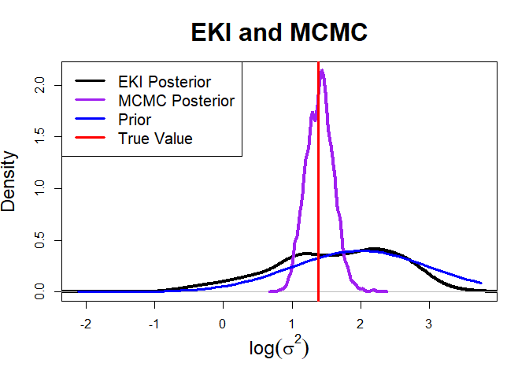<!-- -->

    ## Next temp is 0.00268948486799199
    ## Next temp is 0.0108614782642619
    ## Next temp is 0.0486473804721147
    ## Next temp is 0.31170541118503
    ## Next temp is 1

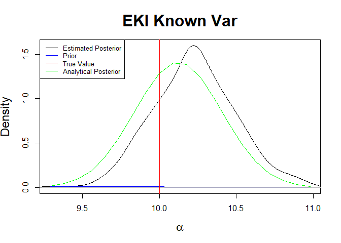<!-- -->

    ## Next temp is 0.238563407776826
    ## Next temp is 0.484240659721324
    ## Next temp is 0.762713232245869
    ## Next temp is 1

<!-- -->

    ## Next temp is 0.00548917883684356
    ## Next temp is 0.0189986296957038
    ## Next temp is 0.0606257944076702
    ## Next temp is 0.156555893441322
    ## Next temp is 0.289660611937118
    ## Next temp is 0.441208674105183
    ## Next temp is 0.620042411733338
    ## Next temp is 0.809513728513498
    ## Next temp is 0.995856281018425
    ## Next temp is 1

<!-- -->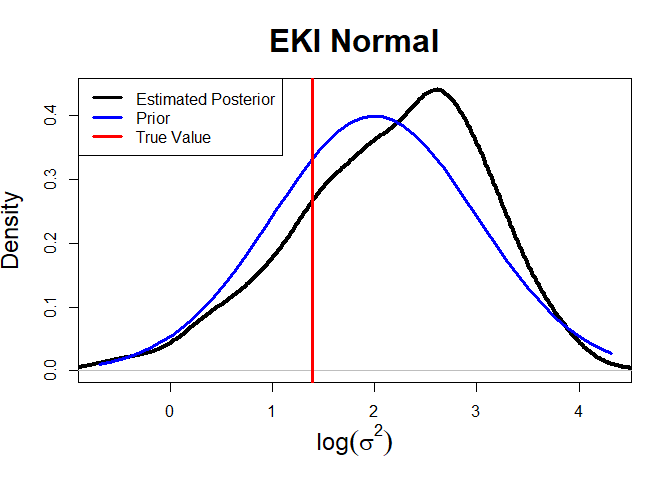<!-- --><!-- --><!-- -->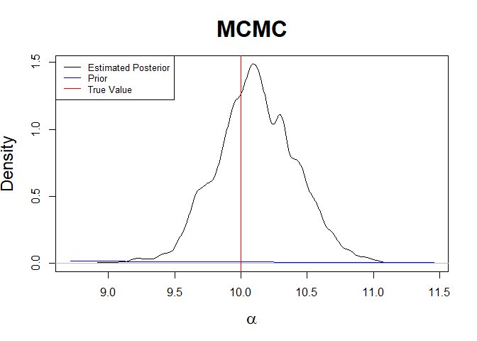<!-- --><!-- --><!-- --><!-- -->

All EKI models and MCMC do well at estimating the mean parameter. There
is no change in how the noise parameter is being estimated across a
range of $\alpha$ values, which is not surprising since the covariance
matrices used to update the particles should not depend on $\alpha$.

## Changing $\sigma^2$

In this experiment I change the true value of $\sigma$ from $2$ to $10$
in increments of $2$. The purpose of this is to determine whether the
EKI algorithm can detect values of $\sigma$ which are further away from
the prior. Additionally, we would expect the $\alpha$ particles to
become more diffuse as the true value of $\sigma$ increases.

``` r
sigma_seq <- seq(8, 10, length.out = 2)
num_dimensions <- 50
num_particles <- 400
for (sigma in sigma_seq) {

  true_parameters <- list(alpha = 2, sigma = sigma, x = rep(1, num_dimensions))
  generate_results(num_particles, true_parameters)
}
```

    ## Next temp is 0.317578745430511
    ## Next temp is 1

<!-- -->

    ## Next temp is 0.00830982433158336
    ## Next temp is 0.0166138095222031
    ## Next temp is 0.0249539221884208
    ## Next temp is 0.0332945229223688
    ## Next temp is 0.041848149279262
    ## Next temp is 0.0506508658820791
    ## Next temp is 0.0597574427984617
    ## Next temp is 0.0686610802793689
    ## Next temp is 0.0777340910972867
    ## Next temp is 0.0868961672294691
    ## Next temp is 0.0960405515999682
    ## Next temp is 0.104980208988893
    ## Next temp is 0.113818687319001
    ## Next temp is 0.122571777115679
    ## Next temp is 0.131576770059937
    ## Next temp is 0.140778749576384
    ## Next temp is 0.149877247654027
    ## Next temp is 0.158949830248086
    ## Next temp is 0.168010703590342
    ## Next temp is 0.177047721910342
    ## Next temp is 0.18603616007361
    ## Next temp is 0.195121964832109
    ## Next temp is 0.20399968592159
    ## Next temp is 0.212877366260361
    ## Next temp is 0.221789526903807
    ## Next temp is 0.230636266643549
    ## Next temp is 0.239504215059692
    ## Next temp is 0.248344310388597
    ## Next temp is 0.257329054153623
    ## Next temp is 0.266292117230184
    ## Next temp is 0.27498144103975
    ## Next temp is 0.283667816480498
    ## Next temp is 0.292210130416608
    ## Next temp is 0.301095061653845
    ## Next temp is 0.310089821809539
    ## Next temp is 0.319181872625439
    ## Next temp is 0.32840243469974
    ## Next temp is 0.337438421677857
    ## Next temp is 0.346699603894654
    ## Next temp is 0.35604325332252
    ## Next temp is 0.365734223480321
    ## Next temp is 0.375452048462077
    ## Next temp is 0.38531122722084
    ## Next temp is 0.395105332453766
    ## Next temp is 0.404701709627136
    ## Next temp is 0.414367796189612
    ## Next temp is 0.424131775744433
    ## Next temp is 0.433987504638238
    ## Next temp is 0.44363719469878
    ## Next temp is 0.453401332383256
    ## Next temp is 0.463312819044323
    ## Next temp is 0.473260337523609
    ## Next temp is 0.483196603841221
    ## Next temp is 0.493242245924428
    ## Next temp is 0.503299497730923
    ## Next temp is 0.513350001584869
    ## Next temp is 0.523366542764579
    ## Next temp is 0.533410887323427
    ## Next temp is 0.543407202339918
    ## Next temp is 0.553146898821945
    ## Next temp is 0.562823538922815
    ## Next temp is 0.572507205174094
    ## Next temp is 0.582345030278303
    ## Next temp is 0.592220164469073
    ## Next temp is 0.60202616809887
    ## Next temp is 0.611817208207333
    ## Next temp is 0.62156621867418
    ## Next temp is 0.631235538461382
    ## Next temp is 0.64088685819424
    ## Next temp is 0.650276129763904
    ## Next temp is 0.659691224025093
    ## Next temp is 0.669048857912732
    ## Next temp is 0.678524480948196
    ## Next temp is 0.687897798663799
    ## Next temp is 0.697224550374039
    ## Next temp is 0.70645578863715
    ## Next temp is 0.715710162009982
    ## Next temp is 0.724755450339121
    ## Next temp is 0.733742791373868
    ## Next temp is 0.742693169163414
    ## Next temp is 0.751528841594775
    ## Next temp is 0.760398987144722
    ## Next temp is 0.76927024431256
    ## Next temp is 0.778133572567678
    ## Next temp is 0.787034757973288
    ## Next temp is 0.795382528093837
    ## Next temp is 0.803530854906425
    ## Next temp is 0.811676594982061
    ## Next temp is 0.819685232627182
    ## Next temp is 0.827807852989158
    ## Next temp is 0.836025615999998
    ## Next temp is 0.844288783788337
    ## Next temp is 0.852566660017867
    ## Next temp is 0.860896211369263
    ## Next temp is 0.869211166980904
    ## Next temp is 0.877526950726432
    ## Next temp is 0.885690245624376
    ## Next temp is 0.893796133771799
    ## Next temp is 0.901825391103375
    ## Next temp is 0.909599146960425
    ## Next temp is 0.917252935678037
    ## Next temp is 0.924864379911613
    ## Next temp is 0.932391582136581
    ## Next temp is 0.939916995926621
    ## Next temp is 0.947491004975852
    ## Next temp is 0.9551683135053
    ## Next temp is 0.962979939260987
    ## Next temp is 0.9707119934096
    ## Next temp is 0.978485277431546
    ## Next temp is 0.986289499379653
    ## Next temp is 0.994013614213219
    ## Next temp is 1

<!-- -->

    ## Next temp is 0.00778387333027191
    ## Next temp is 0.0170776568759915
    ## Next temp is 0.0268547201581567
    ## Next temp is 0.0370829321592178
    ## Next temp is 0.0475496329285762
    ## Next temp is 0.0579140915504165
    ## Next temp is 0.0681630201452464
    ## Next temp is 0.0786783963760432
    ## Next temp is 0.0891569922305422
    ## Next temp is 0.0999867796146089
    ## Next temp is 0.110426970783101
    ## Next temp is 0.12072049440245
    ## Next temp is 0.130826189464102
    ## Next temp is 0.14084886108092
    ## Next temp is 0.150975746216918
    ## Next temp is 0.160980144815874
    ## Next temp is 0.171106084417728
    ## Next temp is 0.181140727678085
    ## Next temp is 0.191471559863803
    ## Next temp is 0.201940386500475
    ## Next temp is 0.212457178839868
    ## Next temp is 0.223093801256187
    ## Next temp is 0.233949153507227
    ## Next temp is 0.24452011383541
    ## Next temp is 0.255133535204363
    ## Next temp is 0.265848211024095
    ## Next temp is 0.276505159388067
    ## Next temp is 0.287015557214146
    ## Next temp is 0.297579893669102
    ## Next temp is 0.307963629124641
    ## Next temp is 0.318211623973892
    ## Next temp is 0.328343977338336
    ## Next temp is 0.338346009615443
    ## Next temp is 0.348294757895369
    ## Next temp is 0.358208782387632
    ## Next temp is 0.368079392231384
    ## Next temp is 0.377977754726933
    ## Next temp is 0.387854700253424
    ## Next temp is 0.397733063159214
    ## Next temp is 0.407562462064219
    ## Next temp is 0.417472524246925
    ## Next temp is 0.427128853578656
    ## Next temp is 0.436687863855402
    ## Next temp is 0.446256306986052
    ## Next temp is 0.456010072504832
    ## Next temp is 0.465798348049151
    ## Next temp is 0.475525541412687
    ## Next temp is 0.48536505966574
    ## Next temp is 0.49522050594607
    ## Next temp is 0.505107289027123
    ## Next temp is 0.515198162378724
    ## Next temp is 0.52539753614497
    ## Next temp is 0.535642106855159
    ## Next temp is 0.545909256624687
    ## Next temp is 0.556250631640093
    ## Next temp is 0.566700728501598
    ## Next temp is 0.577021784723979
    ## Next temp is 0.587270760285845
    ## Next temp is 0.597446021374894
    ## Next temp is 0.607597852558814
    ## Next temp is 0.617779629747969
    ## Next temp is 0.628027770910004
    ## Next temp is 0.638470701730915
    ## Next temp is 0.649111683373663
    ## Next temp is 0.659809962989275
    ## Next temp is 0.670259054941796
    ## Next temp is 0.680769060878499
    ## Next temp is 0.691399711471636
    ## Next temp is 0.701908507480285
    ## Next temp is 0.712615674658426
    ## Next temp is 0.723627961435095
    ## Next temp is 0.734964484440753
    ## Next temp is 0.746343060033935
    ## Next temp is 0.757350519531627
    ## Next temp is 0.768291094323174
    ## Next temp is 0.77890252353963
    ## Next temp is 0.789529513559825
    ## Next temp is 0.800345796132536
    ## Next temp is 0.81109292426225
    ## Next temp is 0.821817155055458
    ## Next temp is 0.832630510411911
    ## Next temp is 0.843802438783015
    ## Next temp is 0.855230717235269
    ## Next temp is 0.8665665159536
    ## Next temp is 0.877824197282259
    ## Next temp is 0.889194194958006
    ## Next temp is 0.900618105249803
    ## Next temp is 0.911983450096279
    ## Next temp is 0.923694394495738
    ## Next temp is 0.935170023015162
    ## Next temp is 0.946901476608933
    ## Next temp is 0.958690234039989
    ## Next temp is 0.970039575513419
    ## Next temp is 0.981531297731181
    ## Next temp is 0.993192836926448
    ## Next temp is 1

<!-- --><!-- --><!-- -->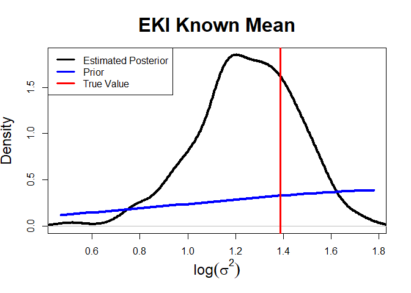<!-- --><!-- --><!-- -->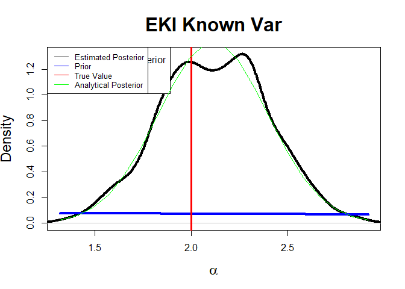<!-- --><!-- -->

    ## Next temp is 0.399016372555618
    ## Next temp is 1

<!-- -->

    ## Next temp is 0.00517418874530351
    ## Next temp is 0.0103361904728086
    ## Next temp is 0.0155684091458749
    ## Next temp is 0.0207189523546178
    ## Next temp is 0.0259386314095977
    ## Next temp is 0.0310976911791752
    ## Next temp is 0.0362391683265993
    ## Next temp is 0.041445614491982
    ## Next temp is 0.0466518903032301
    ## Next temp is 0.0518590640534357
    ## Next temp is 0.0571780793234148
    ## Next temp is 0.0624348733552373
    ## Next temp is 0.0677474478702877
    ## Next temp is 0.0730643005572247
    ## Next temp is 0.0783470409806212
    ## Next temp is 0.0835533276602444
    ## Next temp is 0.0887297331972424
    ## Next temp is 0.0940524338204965
    ## Next temp is 0.0994796416895164
    ## Next temp is 0.104983698387646
    ## Next temp is 0.11046120596685
    ## Next temp is 0.116020792454462
    ## Next temp is 0.121620021038364
    ## Next temp is 0.127401654311189
    ## Next temp is 0.133275668150031
    ## Next temp is 0.139035718692236
    ## Next temp is 0.144746581010172
    ## Next temp is 0.150491386197221
    ## Next temp is 0.156182471040585
    ## Next temp is 0.161883415716437
    ## Next temp is 0.167479935791186
    ## Next temp is 0.173172959330835
    ## Next temp is 0.178872527713374
    ## Next temp is 0.184617999281331
    ## Next temp is 0.190337987546424
    ## Next temp is 0.195965520615822
    ## Next temp is 0.201588074365063
    ## Next temp is 0.207151572080389
    ## Next temp is 0.212741031278105
    ## Next temp is 0.218262944375023
    ## Next temp is 0.223801076879325
    ## Next temp is 0.229303082983462
    ## Next temp is 0.234849555180021
    ## Next temp is 0.240395945209693
    ## Next temp is 0.245991059344403
    ## Next temp is 0.251608956941943
    ## Next temp is 0.257178521440164
    ## Next temp is 0.262774619256587
    ## Next temp is 0.268480500095858
    ## Next temp is 0.274204057119194
    ## Next temp is 0.27986298810025
    ## Next temp is 0.285446519763861
    ## Next temp is 0.291114637720496
    ## Next temp is 0.296702161305603
    ## Next temp is 0.302266490827483
    ## Next temp is 0.3077758785427
    ## Next temp is 0.31323036461001
    ## Next temp is 0.318685427173969
    ## Next temp is 0.323996037560698
    ## Next temp is 0.329351244743499
    ## Next temp is 0.334725357361443
    ## Next temp is 0.340142166493146
    ## Next temp is 0.345525078855722
    ## Next temp is 0.350887226122369
    ## Next temp is 0.356127480992503
    ## Next temp is 0.361351455333591
    ## Next temp is 0.366525197633355
    ## Next temp is 0.371614244038074
    ## Next temp is 0.376676394182637
    ## Next temp is 0.381695676464225
    ## Next temp is 0.386652524520996
    ## Next temp is 0.391688768053447
    ## Next temp is 0.396676729512484
    ## Next temp is 0.401680691389079
    ## Next temp is 0.406705030887345
    ## Next temp is 0.411754316763898
    ## Next temp is 0.416778415759677
    ## Next temp is 0.421746483948688
    ## Next temp is 0.42673233549697
    ## Next temp is 0.431724528429913
    ## Next temp is 0.436654628769155
    ## Next temp is 0.441618143713967
    ## Next temp is 0.446546108702154
    ## Next temp is 0.451442836516756
    ## Next temp is 0.45633523786672
    ## Next temp is 0.461171870401028
    ## Next temp is 0.465949375010882
    ## Next temp is 0.470758943812484
    ## Next temp is 0.475608099305115
    ## Next temp is 0.480495734427746
    ## Next temp is 0.485472285040444
    ## Next temp is 0.490456623578036
    ## Next temp is 0.495461577804476
    ## Next temp is 0.500439695674786
    ## Next temp is 0.505471094723046
    ## Next temp is 0.510537885056673
    ## Next temp is 0.515737903439568
    ## Next temp is 0.521040581682407
    ## Next temp is 0.526413550890054
    ## Next temp is 0.531835583864084
    ## Next temp is 0.537247267592066
    ## Next temp is 0.542581572441454
    ## Next temp is 0.547952640592197
    ## Next temp is 0.553320296524814
    ## Next temp is 0.558641506655071
    ## Next temp is 0.563886777983185
    ## Next temp is 0.569039092324972
    ## Next temp is 0.574224856254857
    ## Next temp is 0.579365092668662
    ## Next temp is 0.584476218884221
    ## Next temp is 0.589508630584211
    ## Next temp is 0.594505998056838
    ## Next temp is 0.599606344977443
    ## Next temp is 0.604718021674483
    ## Next temp is 0.609834448115612
    ## Next temp is 0.614856407708701
    ## Next temp is 0.619888176597578
    ## Next temp is 0.624882893842793
    ## Next temp is 0.62984904006413
    ## Next temp is 0.634811249372088
    ## Next temp is 0.639813018993552
    ## Next temp is 0.644806488866251
    ## Next temp is 0.649779039097468
    ## Next temp is 0.654744319892004
    ## Next temp is 0.659667977641238
    ## Next temp is 0.664605409320716
    ## Next temp is 0.669451478383939
    ## Next temp is 0.674295576271449
    ## Next temp is 0.679187265600281
    ## Next temp is 0.684049092041319
    ## Next temp is 0.688957860812259
    ## Next temp is 0.693792251601874
    ## Next temp is 0.698661054762121
    ## Next temp is 0.703579652593906
    ## Next temp is 0.708479906703922
    ## Next temp is 0.713487068728073
    ## Next temp is 0.718487121540489
    ## Next temp is 0.723471442951772
    ## Next temp is 0.72845535624055
    ## Next temp is 0.73344421272068
    ## Next temp is 0.738451281989188
    ## Next temp is 0.743439641839871
    ## Next temp is 0.748438718689808
    ## Next temp is 0.753499610528931
    ## Next temp is 0.758559188221235
    ## Next temp is 0.763674080948528
    ## Next temp is 0.768826113956404
    ## Next temp is 0.77403712562641
    ## Next temp is 0.779202647673191
    ## Next temp is 0.784396416377261
    ## Next temp is 0.78971887619823
    ## Next temp is 0.795061544291874
    ## Next temp is 0.800349656502874
    ## Next temp is 0.805651411644446
    ## Next temp is 0.810940447306779
    ## Next temp is 0.816211567698508
    ## Next temp is 0.821542545058951
    ## Next temp is 0.826838614543658
    ## Next temp is 0.832221584680944
    ## Next temp is 0.837604210610124
    ## Next temp is 0.842918346766251
    ## Next temp is 0.848370291643162
    ## Next temp is 0.853839112470613
    ## Next temp is 0.859315971231115
    ## Next temp is 0.86480223347114
    ## Next temp is 0.870299231191946
    ## Next temp is 0.87580916728776
    ## Next temp is 0.881297731443452
    ## Next temp is 0.886891408059503
    ## Next temp is 0.892465713206939
    ## Next temp is 0.898004287126594
    ## Next temp is 0.90361650539126
    ## Next temp is 0.909156941631985
    ## Next temp is 0.914708097249825
    ## Next temp is 0.920350434639685
    ## Next temp is 0.925888139143026
    ## Next temp is 0.931417211929918
    ## Next temp is 0.936911216595984
    ## Next temp is 0.94243246731065
    ## Next temp is 0.948072022301482
    ## Next temp is 0.953733159299218
    ## Next temp is 0.959349004941174
    ## Next temp is 0.965186471143026
    ## Next temp is 0.971026535468337
    ## Next temp is 0.97697453708656
    ## Next temp is 0.982773028364903
    ## Next temp is 0.988534357607563
    ## Next temp is 0.994357219343069
    ## Next temp is 1

<!-- -->

    ## Next temp is 0.0041427927019166
    ## Next temp is 0.0086084408008155
    ## Next temp is 0.0133224739661482
    ## Next temp is 0.0180452190883003
    ## Next temp is 0.0227243616938755
    ## Next temp is 0.0274438082388998
    ## Next temp is 0.0321553941736916
    ## Next temp is 0.036883192599719
    ## Next temp is 0.0416348305098277
    ## Next temp is 0.0464654076102368
    ## Next temp is 0.0513377149909871
    ## Next temp is 0.0562983771679075
    ## Next temp is 0.061408018212585
    ## Next temp is 0.0665925252368727
    ## Next temp is 0.0718111417586065
    ## Next temp is 0.077084048430545
    ## Next temp is 0.0823992054736516
    ## Next temp is 0.0879066812167893
    ## Next temp is 0.0934651392705295
    ## Next temp is 0.0990006327919465
    ## Next temp is 0.10457832485227
    ## Next temp is 0.110058840781597
    ## Next temp is 0.115513062945972
    ## Next temp is 0.121048021298988
    ## Next temp is 0.126497017384418
    ## Next temp is 0.131990869939951
    ## Next temp is 0.137401331315441
    ## Next temp is 0.142873998421115
    ## Next temp is 0.148294340423662
    ## Next temp is 0.153738923439964
    ## Next temp is 0.159118572919945
    ## Next temp is 0.164562759272133
    ## Next temp is 0.170029297148688
    ## Next temp is 0.17553598901429
    ## Next temp is 0.181127453627446
    ## Next temp is 0.186764825977586
    ## Next temp is 0.192412427856017
    ## Next temp is 0.198106095023358
    ## Next temp is 0.203870500644815
    ## Next temp is 0.209597955240021
    ## Next temp is 0.215166862382258
    ## Next temp is 0.220710697543326
    ## Next temp is 0.226233741294767
    ## Next temp is 0.231703399844134
    ## Next temp is 0.237114963888914
    ## Next temp is 0.242491642934155
    ## Next temp is 0.247900839575532
    ## Next temp is 0.253339689321287
    ## Next temp is 0.25874213257457
    ## Next temp is 0.264189107818496
    ## Next temp is 0.269575054436187
    ## Next temp is 0.27500378112115
    ## Next temp is 0.280545840200331
    ## Next temp is 0.286074416819835
    ## Next temp is 0.291556628223305
    ## Next temp is 0.296950483382585
    ## Next temp is 0.302334204593298
    ## Next temp is 0.307665095823763
    ## Next temp is 0.312967834730769
    ## Next temp is 0.318228666761877
    ## Next temp is 0.32356244028478
    ## Next temp is 0.328832077192205
    ## Next temp is 0.334053690632259
    ## Next temp is 0.339295861332205
    ## Next temp is 0.344542753297251
    ## Next temp is 0.349779717296949
    ## Next temp is 0.355130292561301
    ## Next temp is 0.360505379587106
    ## Next temp is 0.365770341777989
    ## Next temp is 0.370947971212048
    ## Next temp is 0.376101688523674
    ## Next temp is 0.381316031493847
    ## Next temp is 0.386546728092518
    ## Next temp is 0.391662958632861
    ## Next temp is 0.396747129468747
    ## Next temp is 0.401833300637404
    ## Next temp is 0.407037111678786
    ## Next temp is 0.412353159311665
    ## Next temp is 0.417708775355407
    ## Next temp is 0.423029541515391
    ## Next temp is 0.428265061512032
    ## Next temp is 0.433559044337396
    ## Next temp is 0.438837054612686
    ## Next temp is 0.444154475856029
    ## Next temp is 0.449486755308308
    ## Next temp is 0.454785876173054
    ## Next temp is 0.460084858771272
    ## Next temp is 0.465482165027116
    ## Next temp is 0.470841754808472
    ## Next temp is 0.476183940660403
    ## Next temp is 0.481443141930883
    ## Next temp is 0.486705085323819
    ## Next temp is 0.49193787249591
    ## Next temp is 0.497277707504025
    ## Next temp is 0.502607611551743
    ## Next temp is 0.508040540293035
    ## Next temp is 0.513458266357986
    ## Next temp is 0.518889252984793
    ## Next temp is 0.524227092403413
    ## Next temp is 0.529514797325674
    ## Next temp is 0.53479791523615
    ## Next temp is 0.540067381007876
    ## Next temp is 0.54545124039392
    ## Next temp is 0.550706894457091
    ## Next temp is 0.555931728526535
    ## Next temp is 0.561223461858289
    ## Next temp is 0.566522744906094
    ## Next temp is 0.571865413907329
    ## Next temp is 0.577213081416461
    ## Next temp is 0.582541785291454
    ## Next temp is 0.587849704726051
    ## Next temp is 0.593027422625469
    ## Next temp is 0.598077833312441
    ## Next temp is 0.603132811840851
    ## Next temp is 0.608156737554197
    ## Next temp is 0.613150316552997
    ## Next temp is 0.618131337484337
    ## Next temp is 0.623092550009665
    ## Next temp is 0.628067038839614
    ## Next temp is 0.633113851561207
    ## Next temp is 0.638213512159395
    ## Next temp is 0.643372986585676
    ## Next temp is 0.648559979264449
    ## Next temp is 0.653753490408689
    ## Next temp is 0.658903152307049
    ## Next temp is 0.664024089513993
    ## Next temp is 0.669126762912592
    ## Next temp is 0.674157930467304
    ## Next temp is 0.679191594732319
    ## Next temp is 0.684325144898669
    ## Next temp is 0.68947032301525
    ## Next temp is 0.69466428690434
    ## Next temp is 0.699889524980841
    ## Next temp is 0.705128143580256
    ## Next temp is 0.710340809859093
    ## Next temp is 0.715476718529099
    ## Next temp is 0.720551660230324
    ## Next temp is 0.725607088450706
    ## Next temp is 0.730681743345796
    ## Next temp is 0.735733699212219
    ## Next temp is 0.740800950038254
    ## Next temp is 0.745949005656389
    ## Next temp is 0.751081948507109
    ## Next temp is 0.756241646009011
    ## Next temp is 0.761412203564845
    ## Next temp is 0.766584217324873
    ## Next temp is 0.771862840013656
    ## Next temp is 0.777180141754505
    ## Next temp is 0.782501334608403
    ## Next temp is 0.787854380252731
    ## Next temp is 0.793246570023081
    ## Next temp is 0.798530137809719
    ## Next temp is 0.803786496417962
    ## Next temp is 0.809092881592025
    ## Next temp is 0.814374827190454
    ## Next temp is 0.819729583319147
    ## Next temp is 0.825011676683455
    ## Next temp is 0.830303526722892
    ## Next temp is 0.835542482724938
    ## Next temp is 0.840880990978084
    ## Next temp is 0.846204443544768
    ## Next temp is 0.851444472061574
    ## Next temp is 0.856642081738479
    ## Next temp is 0.861892315508773
    ## Next temp is 0.867190896403296
    ## Next temp is 0.872492673077383
    ## Next temp is 0.877756857694719
    ## Next temp is 0.883047916221031
    ## Next temp is 0.888242177331056
    ## Next temp is 0.893385292041097
    ## Next temp is 0.898587951502308
    ## Next temp is 0.903840186481889
    ## Next temp is 0.909115279537881
    ## Next temp is 0.914404627674249
    ## Next temp is 0.919771101786531
    ## Next temp is 0.925162002779922
    ## Next temp is 0.930463151213052
    ## Next temp is 0.935783452257913
    ## Next temp is 0.940980158427672
    ## Next temp is 0.946120238722977
    ## Next temp is 0.951279985750174
    ## Next temp is 0.956440278634213
    ## Next temp is 0.961582839134472
    ## Next temp is 0.966777609652405
    ## Next temp is 0.971925555571558
    ## Next temp is 0.977000727134341
    ## Next temp is 0.982079022867389
    ## Next temp is 0.987144163052502
    ## Next temp is 0.992193815670801
    ## Next temp is 0.997204835280975
    ## Next temp is 1

<!-- -->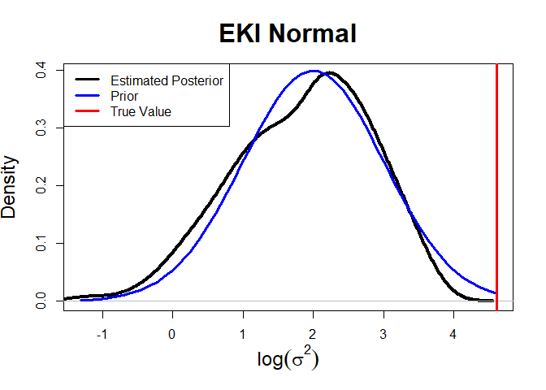<!-- --><!-- -->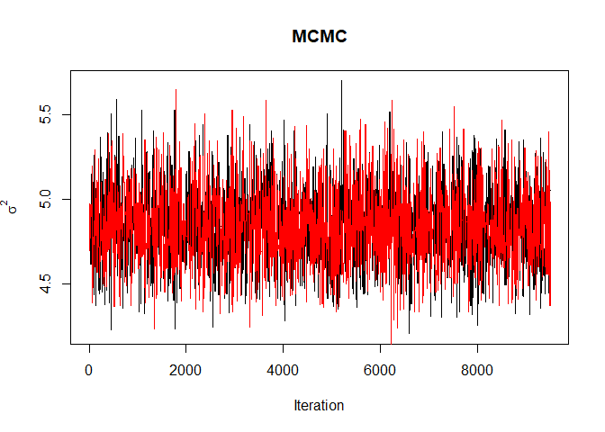<!-- --><!-- --><!-- --><!-- -->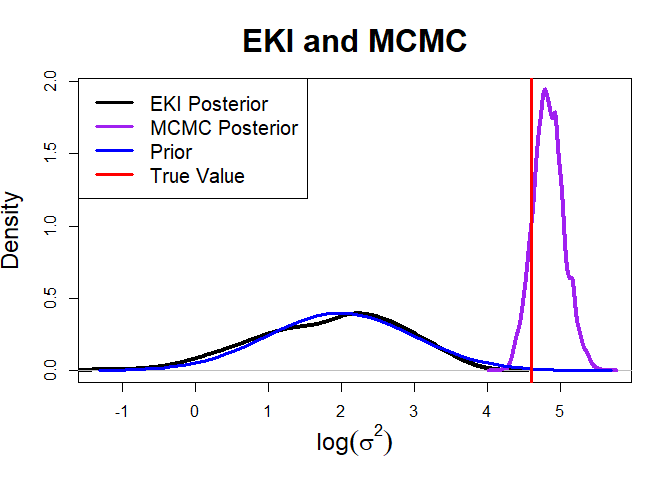<!-- -->

In the known variance case, the results for the mean parameter are what
we expect. That is, the particles are centered around the true value and
they become more diffuse as $\sigma^2$ increases. However, the ability
of the other EKI models to estimate the true noise parameter is poor.
Regardless of the true value of $\sigma^2$, the particles remain
anchored to their prior distribution. In the cases where the prior is
lower than the true value of $\sigma^2$, the $\alpha$ values become too
concentrated. This is problematic if we don’t have strong information
about the noise parameter to specify a good prior distribution.

## Changing Number of Particles

Finally I change the number of particles used for the EKI algorithm. The
main purpose of this is to check that the EKI model with known variance
concentrates around the true posterior distribution.

``` r
num_dimensions <- 50
particle_seq <- c(100, 500, 1000) 
true_parameters <- list(alpha = 2, sigma = 2, x = rep(1, num_dimensions))

for (num_particles in particle_seq) {
  generate_results(num_particles, true_parameters)
}
```

    ## Next temp is 0.0174014280030635
    ## Next temp is 0.312061809376098
    ## Next temp is 1

<!-- -->

    ## Next temp is 0.216148560422273
    ## Next temp is 0.406107681945572
    ## Next temp is 0.59096408306859
    ## Next temp is 0.845878020941185
    ## Next temp is 1

<!-- -->

    ## Next temp is 0.0294884453942916
    ## Next temp is 0.155039223847345
    ## Next temp is 0.378237345404976
    ## Next temp is 0.822744895061512
    ## Next temp is 1

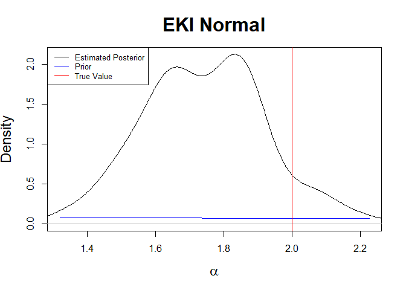<!-- --><!-- -->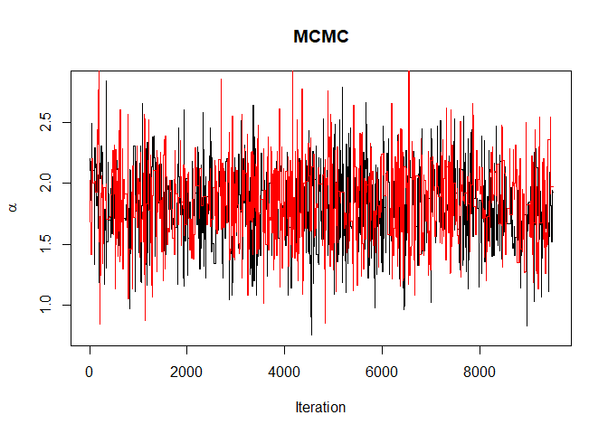<!-- --><!-- -->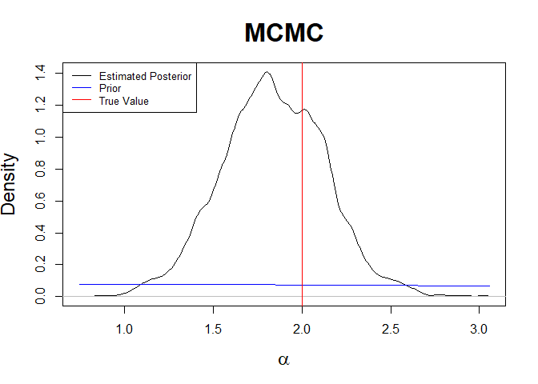<!-- --><!-- -->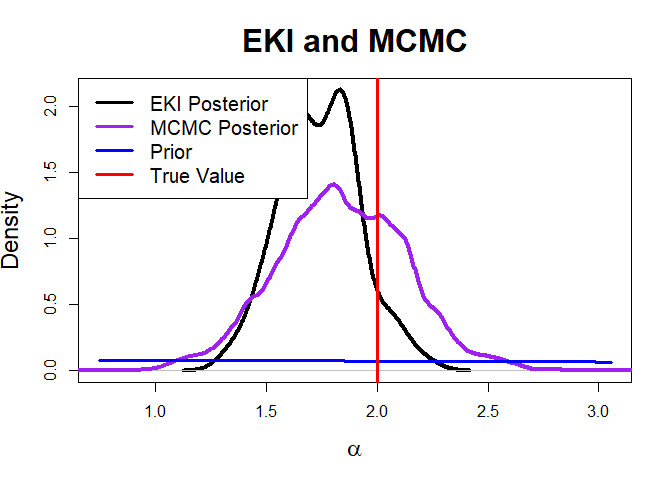<!-- --><!-- -->

    ## Next temp is 0.016495369078294
    ## Next temp is 0.170423764664087
    ## Next temp is 1

<!-- -->

    ## Next temp is 0.169310227228688
    ## Next temp is 0.337292998455526
    ## Next temp is 0.513336026425228
    ## Next temp is 0.69486718005395
    ## Next temp is 0.871441894221176
    ## Next temp is 1

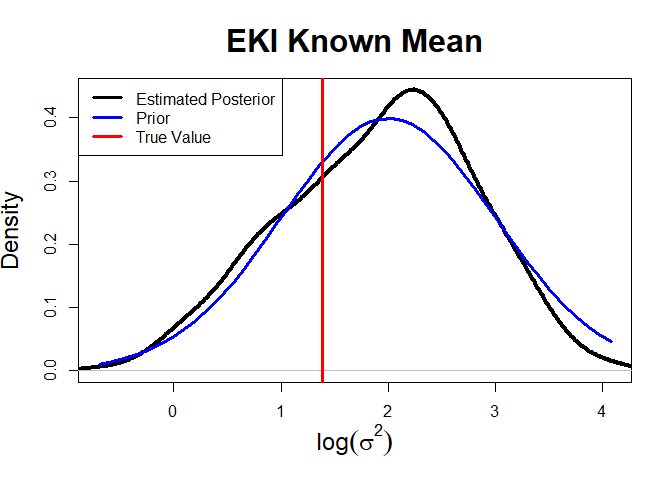<!-- -->

    ## Next temp is 0.0294713763049089
    ## Next temp is 0.0906959385725093
    ## Next temp is 0.175075327969999
    ## Next temp is 0.278745273190197
    ## Next temp is 0.401323828855113
    ## Next temp is 0.533888130374379
    ## Next temp is 0.671595303365991
    ## Next temp is 0.808505009299936
    ## Next temp is 0.953129119294776
    ## Next temp is 1

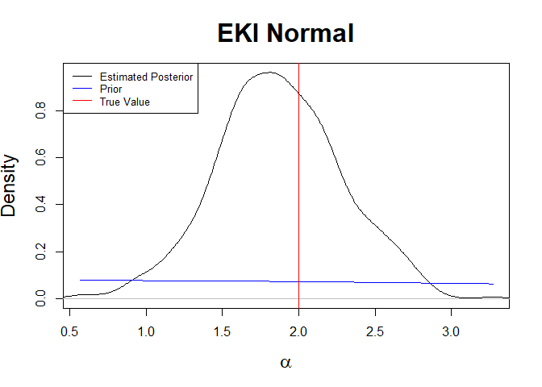<!-- --><!-- -->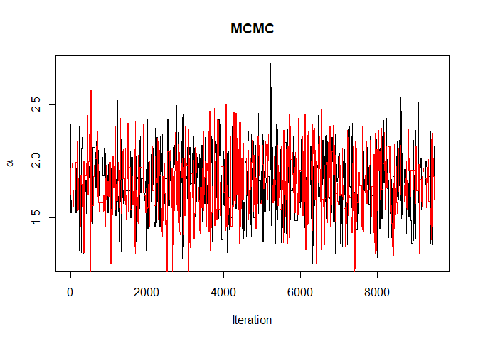<!-- -->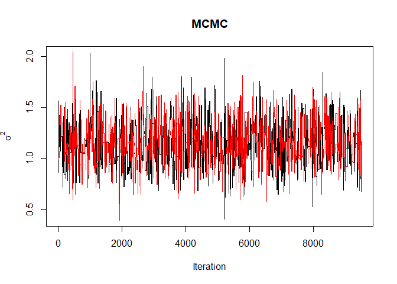<!-- --><!-- --><!-- -->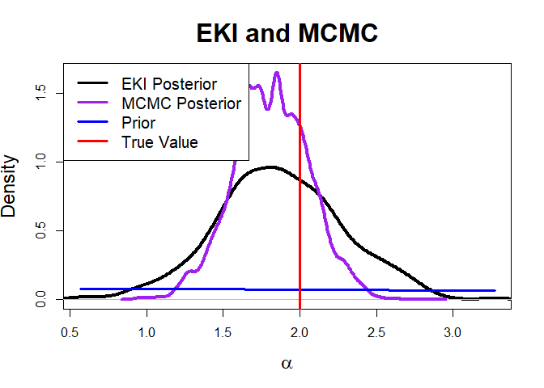<!-- -->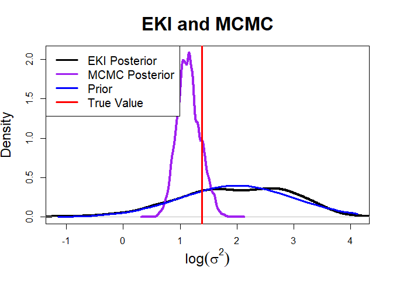<!-- -->

    ## Next temp is 0.0159133226636764
    ## Next temp is 0.146470861826986
    ## Next temp is 1

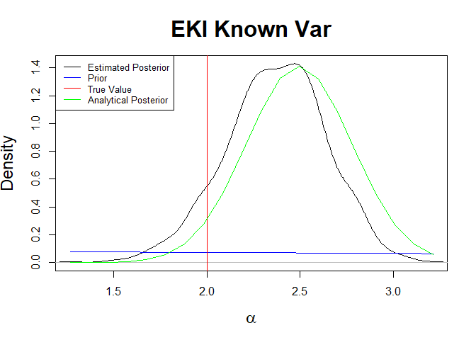<!-- -->

    ## Next temp is 0.215908644196514
    ## Next temp is 0.432201254231142
    ## Next temp is 0.660321237036518
    ## Next temp is 0.89647098802851
    ## Next temp is 1

<!-- -->

    ## Next temp is 0.0277977621633208
    ## Next temp is 0.0994502845666412
    ## Next temp is 0.2044749996248
    ## Next temp is 0.334335561466516
    ## Next temp is 0.484790310838703
    ## Next temp is 0.650214442000149
    ## Next temp is 0.825003922741202
    ## Next temp is 1

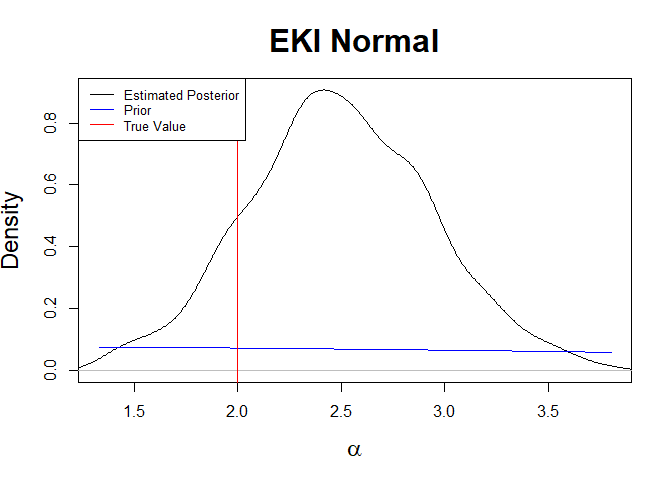<!-- --><!-- -->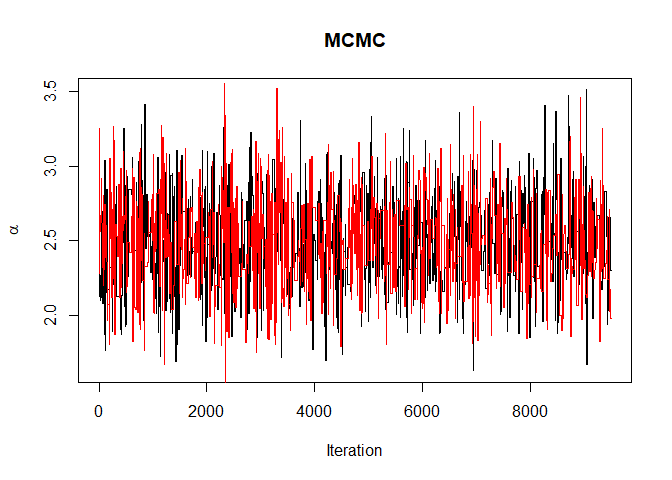<!-- -->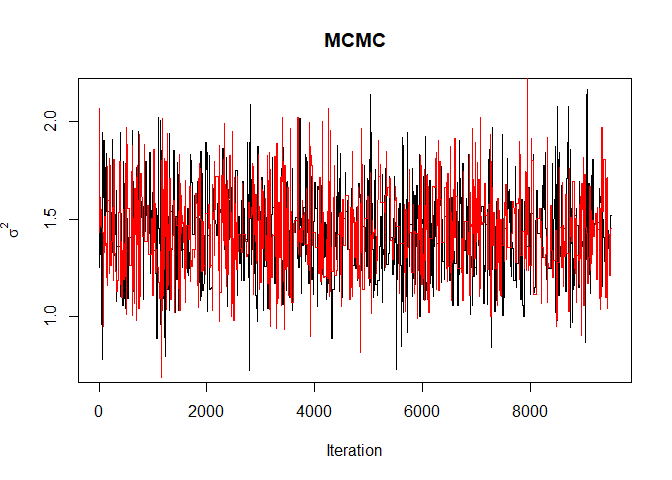<!-- --><!-- -->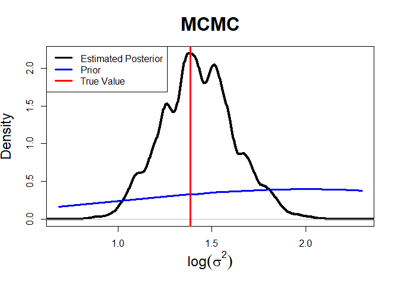<!-- --><!-- --><!-- -->

Indeed we find that this is the case.

## Lognormal Model

Considering that the normal model does poorly when looking at the noise
parameter, we try an alternative model specification. Specifically, we
look at the lognormal distribution. Unlike the normal distribution, the
noise parameter effects the mean of the observations, so we should
expect a signal with the data. I only look at changing the noise
parameter in this case.

``` r
prior_params <- list(alpha.mean = 0, alpha.sd = 1, 
                     sigma2.mean = -0.5, sigma2.sd = 1)
```

``` r
sigma_seq <- seq(0.5, 2.5, length.out = 5)
num_dimensions <- 50
num_particles <- 400
for (sigma in sigma_seq) {

  true_parameters <- list(alpha = 2, sigma = sigma, x = rep(1, num_dimensions))
  generate_lognormal_results(num_particles, true_parameters, prior_params)
}
```

    ## Next temp is 0.203589439618237
    ## Next temp is 0.455366668091081
    ## Next temp is 0.935950665103429
    ## Next temp is 1

<!-- -->

    ## Next temp is 0.0132696244481653
    ## Next temp is 0.0279291257003383
    ## Next temp is 0.0449092133182892
    ## Next temp is 0.0636539056108814
    ## Next temp is 0.0837879651792808
    ## Next temp is 0.10715130497637
    ## Next temp is 0.132951610518415
    ## Next temp is 0.161446331973873
    ## Next temp is 0.19191785537094
    ## Next temp is 0.226091775637552
    ## Next temp is 0.2656933856163
    ## Next temp is 0.308533133663233
    ## Next temp is 0.354213881092237
    ## Next temp is 0.408508861031648
    ## Next temp is 0.464158192098195
    ## Next temp is 0.523719236912736
    ## Next temp is 0.586359575723372
    ## Next temp is 0.653732932440766
    ## Next temp is 0.72247034108825
    ## Next temp is 0.796344045399359
    ## Next temp is 0.874142796385957
    ## Next temp is 0.951604410796315
    ## Next temp is 1

<!-- -->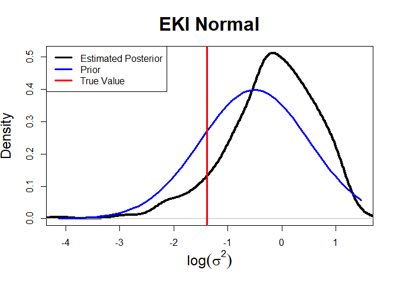<!-- -->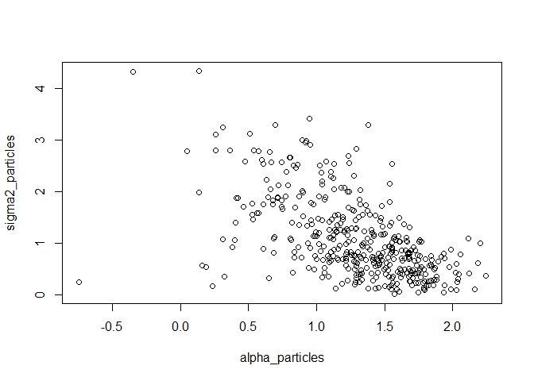<!-- --><!-- --><!-- --><!-- -->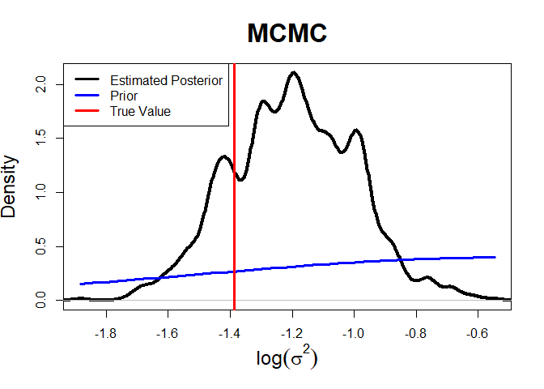<!-- -->

    ## Next temp is 0.173100684614871
    ## Next temp is 0.410183722837192
    ## Next temp is 0.749575236777573
    ## Next temp is 0.947155907475202
    ## Next temp is 1

<!-- -->

    ## Next temp is 0.01145239000525
    ## Next temp is 0.0272054372097533
    ## Next temp is 0.0455394083544671
    ## Next temp is 0.0671414829590062
    ## Next temp is 0.0905854118355116
    ## Next temp is 0.12158713353805
    ## Next temp is 0.158349176039438
    ## Next temp is 0.202159020154327
    ## Next temp is 0.253957764890594
    ## Next temp is 0.317873543168957
    ## Next temp is 0.389764191947272
    ## Next temp is 0.478389945437308
    ## Next temp is 0.584590365129597
    ## Next temp is 0.710068509462481
    ## Next temp is 0.84680189236376
    ## Next temp is 1

<!-- --><!-- --><!-- --><!-- -->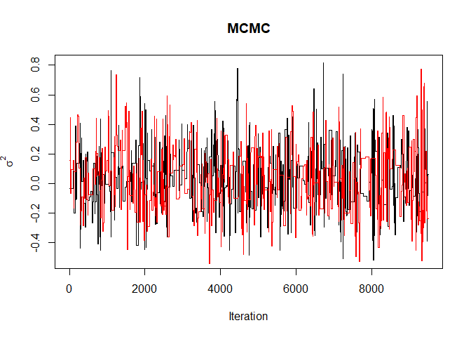<!-- -->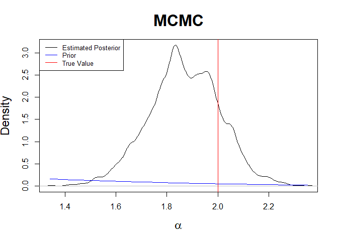<!-- --><!-- -->

    ## Next temp is 0.0382323322736043
    ## Next temp is 0.0859808663359125
    ## Next temp is 0.142539129868987
    ## Next temp is 0.231479827590734
    ## Next temp is 0.339229973284792
    ## Next temp is 0.464452014283767
    ## Next temp is 0.619601898878787
    ## Next temp is 0.836554703829318
    ## Next temp is 1

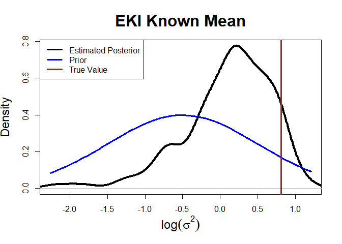<!-- -->

    ## Next temp is 0.00978336779974627
    ## Next temp is 0.0217561990761319
    ## Next temp is 0.0371481504907784
    ## Next temp is 0.0579697109019022
    ## Next temp is 0.0823048644695982
    ## Next temp is 0.112104193436321
    ## Next temp is 0.143927543361101
    ## Next temp is 0.180255791843394
    ## Next temp is 0.227282501304723
    ## Next temp is 0.275081231608325
    ## Next temp is 0.331922949992574
    ## Next temp is 0.399067817001748
    ## Next temp is 0.490822558053302
    ## Next temp is 0.606540451596083
    ## Next temp is 0.735242678292354
    ## Next temp is 0.896027207063672
    ## Next temp is 1

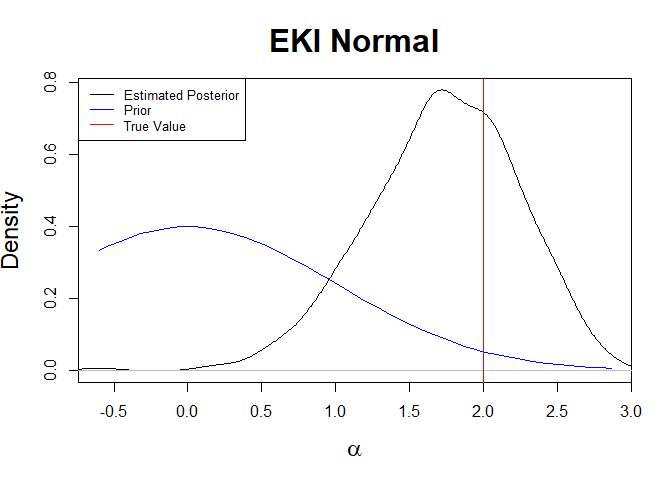<!-- --><!-- --><!-- -->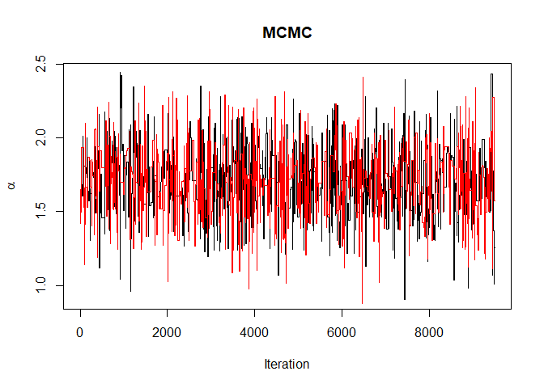<!-- -->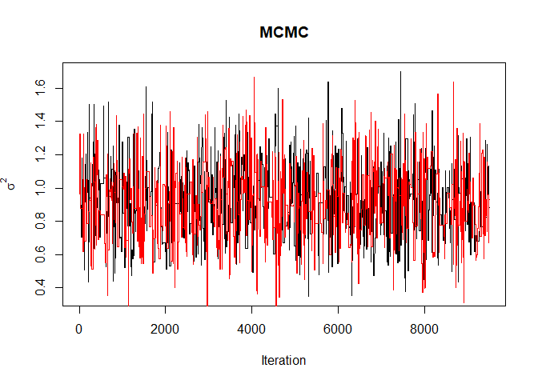<!-- --><!-- --><!-- -->

    ## Next temp is 0.0152819479599127
    ## Next temp is 0.0319976766364719
    ## Next temp is 0.0532021322430754
    ## Next temp is 0.081223811168185
    ## Next temp is 0.132611695097213
    ## Next temp is 0.371719093282963
    ## Next temp is 0.652919700739114
    ## Next temp is 1

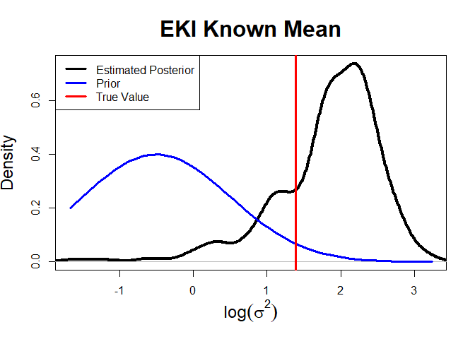<!-- -->

    ## Next temp is 0.00636005965845609
    ## Next temp is 0.0201756456724634
    ## Next temp is 0.0364786024217232
    ## Next temp is 0.0539940894800892
    ## Next temp is 0.075524691279357
    ## Next temp is 0.0979259905196744
    ## Next temp is 0.121699829682854
    ## Next temp is 0.149862086518355
    ## Next temp is 0.187382841194841
    ## Next temp is 0.235267482302462
    ## Next temp is 0.284200601796538
    ## Next temp is 0.345686212581364
    ## Next temp is 0.40846324969657
    ## Next temp is 0.466875988263182
    ## Next temp is 0.534085574810106
    ## Next temp is 0.614646418226636
    ## Next temp is 0.723885245099099
    ## Next temp is 0.826416798570102
    ## Next temp is 0.929803453411877
    ## Next temp is 1

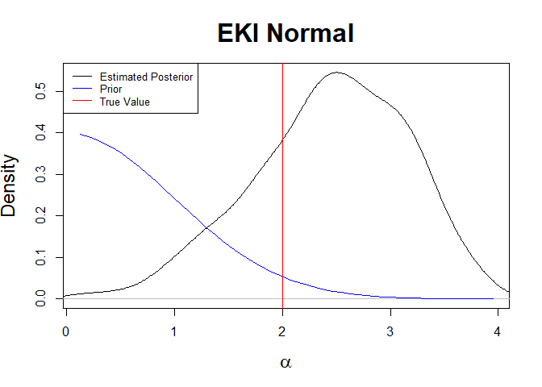<!-- -->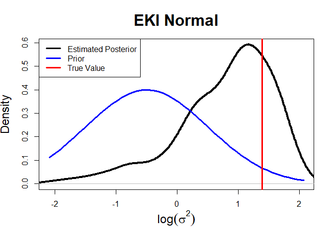<!-- -->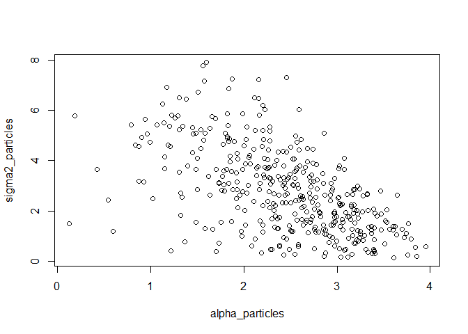<!-- --><!-- -->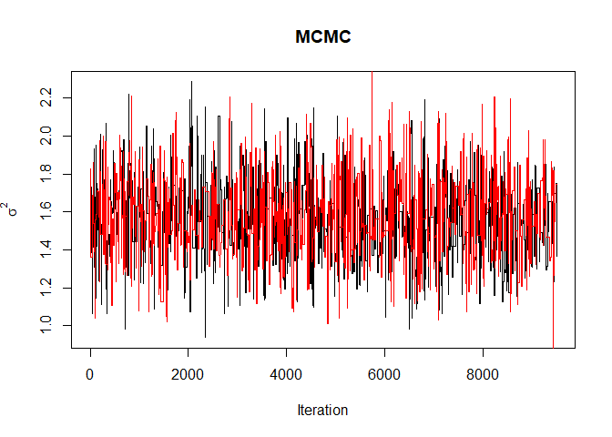<!-- --><!-- -->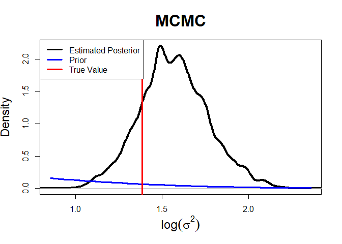<!-- -->

    ## Next temp is 0.0108996336200435
    ## Next temp is 0.0205191845894731
    ## Next temp is 0.0472738832067858
    ## Next temp is 0.203746509712401
    ## Next temp is 0.446864315060878
    ## Next temp is 0.829125055204189
    ## Next temp is 1

<!-- -->

    ## Next temp is 0.00432232768268127
    ## Next temp is 0.0166007713275291
    ## Next temp is 0.0303947069251006
    ## Next temp is 0.045094743280325
    ## Next temp is 0.0623934213446238
    ## Next temp is 0.0973584497713112
    ## Next temp is 0.141149149758397
    ## Next temp is 0.18529403786814
    ## Next temp is 0.23682193192374
    ## Next temp is 0.31586528986728
    ## Next temp is 0.401839859517995
    ## Next temp is 0.489431511577097
    ## Next temp is 0.587387926429789
    ## Next temp is 0.691365086986323
    ## Next temp is 0.793816113056588
    ## Next temp is 0.906325802286
    ## Next temp is 1

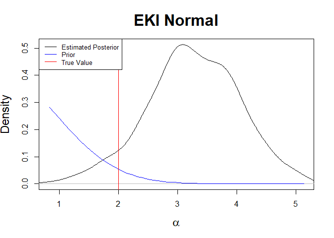<!-- -->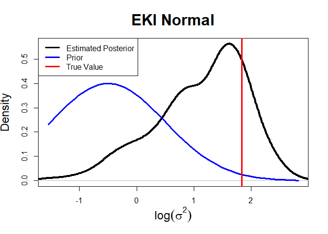<!-- -->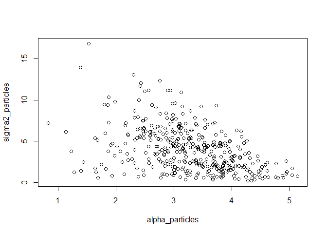<!-- -->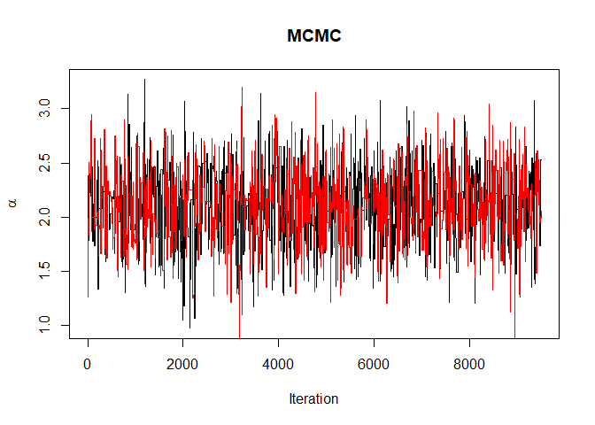<!-- -->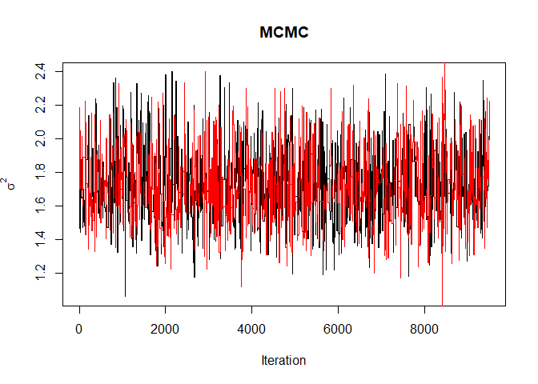<!-- -->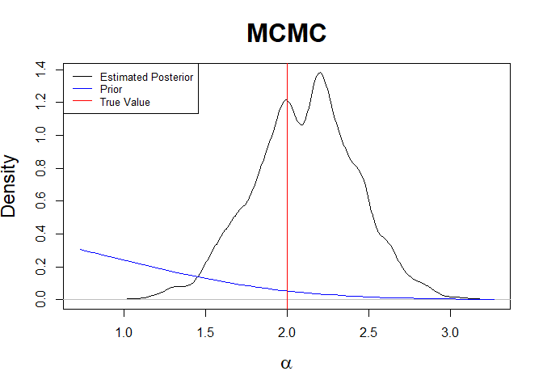<!-- --><!-- -->

## Summary Statistics

In this section, we further summarize the data into two summary
statistics $(\bar{y}, s_y)$ which are jointly sufficient for the
parameters. This is because we expect a correlation between $\sigma^2$
and $s_y$ which should allow us to estimate the parameters. Because they
are sufficient, the posterior is still exact in the linear Gaussian
case.

We can see that GEKI does well at estimating both parameters in this
model when we use summary statistics. This is interesting considering it
doesn’t do well when using the full data.

## Conclusion

To summarize, GEKI does well at estimating the mean parameter, but does
poorly at estimating the noise parameter, remaining anchored to its
prior distribution. By contrast, MCMC does well at estimating both
parameters. One explanation for this phenomenon is that the GEKI
algorithm relies on a cross covariance between the parameters and the
data, but $\sigma^2$ and $y$ are theoretically uncorrelated. See
`results_covariances.md` for further detail.
